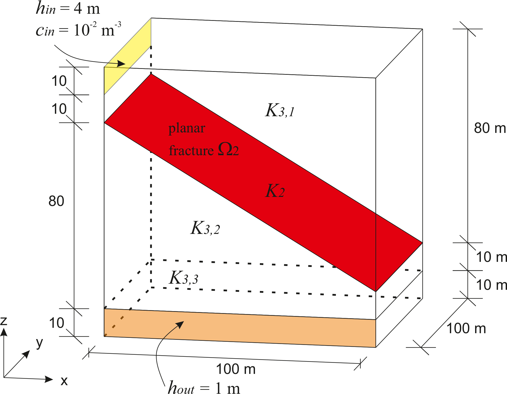

Coupled Matrix-Fracture Flow and Transport
==========================================

Capabilties Tested
------------------

This three-dimensional transport problem, with a constant contaminant 
boundary condition and a steady-state flow field, tests the Amanzi
coupled flow and transport model.  
Capabilties tested include
  
  * coupled steady-state velocity field in matrix and fracture network
  * constant boundary condition for tracer
  * transport in coupled matrix and fracture network system
  * implicit time integration for transport
  * single fracture case

For details on this test, see :ref:`about_single_fracture`.

Background
----------

This test problem is motivated by confined flow applications with
transport through fractured rock. A typical fracture network provides
a fast path for flow and transport and is a reasonable model for short
term predictions. However, long term predictions require to consider
interaction of fracture network with the surrounding rock.
The dominant transport process considered in this benchmark is 
advection.
Accuracy of the concentration in matrix and at outlet regions are
compared against other codes.

Model
-----

The models for for steady-state flow include two coupled Darcy law equations.
Let subscripts :math:`m` and :math:`f` correspond to matrix and fracture, respectively.
Then,

.. math::
  \begin{array}{l}
  - \boldsymbol{\nabla} \cdot (\rho \boldsymbol{q}_m) = 0,
  \quad
  \boldsymbol{q}_m = -\displaystyle\frac{K_m}{\mu} 
  (\boldsymbol{\nabla} p_m - \rho \boldsymbol{g}) \\
  %
  -\boldsymbol{\nabla} \cdot (\rho \boldsymbol{q}_f) = 
    -[[ \widetilde{\boldsymbol{q}}_m \cdot \boldsymbol{n} ]],
  \quad
  \boldsymbol{q}_f = -\displaystyle\frac{K_f}{\mu} 
  (\boldsymbol{\nabla} p_f - \rho \boldsymbol{g}) \\
  %
  \widetilde{\boldsymbol{q}}_m \cdot \boldsymbol{n} = k (p_f - p_m)
  \end{array}

subject to conventional boundary conditions for both matrix and fracture domains expect for 
the matrix-fracture interface where the flux continuity condition is imposed:

.. math::
  \boldsymbol{q}_m \cdot \boldsymbol{n} = \widetilde{\boldsymbol{q}}_m \cdot \boldsymbol{n}.

Here
:math:`\rho` is fluid density [kg/m^3],
:math:`\mu` is fluid viscosity,
:math:`p` is aqueous pressure [Pa],
:math:`K` is absolute permeability [m^2] for matrix domain and [m^3] for fracture domain,
:math:`\boldsymbol{q}` is the Darcy velocity [m/s] for matrix domain and [m^2/s] for fracture domain,
:math:`k` is effective normal permeability [m/s/Pa],
and
:math:`\boldsymbol{g}` is gravity.

The conceptual model of the coupled matrix-fracture advective transport is

.. math::
  \begin{array}{l}
  \displaystyle\frac{\partial(\phi_m C_m)}{\partial t} = 
    -\boldsymbol{\nabla} \cdot (\boldsymbol{q}_m C_m) = Q_m,\\
  %
  \displaystyle \frac{\partial(\varepsilon_f\phi_f C_f)}{\partial t} = 
    -\boldsymbol{\nabla} \cdot (\boldsymbol{q}_f C_f)
    +[[ \tilde{C} (\boldsymbol{q}_m \cdot \boldsymbol{n}) ]] + Q_f,
  \end{array}

subject to the Dirichlet boundary conditions on the inflow part of the computational domain.
Here
:math:`\phi` is porosity [-],
:math:`Q` is source or sink term,
:math:`\varepsilon_f` is fracture cross-sectional length [m],
and
:math:`\tilde{C}` is concentration in fracture for outflow and in matrix for inflow.

Problem Specification
---------------------

Schematic
~~~~~~~~~

The domain, fracture location, and boundary conditions are shown in the schematic below.
The solute enters domain through a narrow band on the left side marked with
yellow color and leaves the domain through outlet marked with orange color.
The flow is driven by the pressure gradient between the inlet and outlet, see data below.

    *Conceptual model and geometric description of fracture, inlet and outlet.*
                    

Mesh
~~~~

The mesh in matrix consists of 8000 hexahedral cells with average size :math:`h=5` m.
The mesh in fracture is the trace of the hexahedral mesh.
It has 400 quadrilateral cells.

Variables
~~~~~~~~~

* :math:`\rho_l=1000.0` constant fluid density,
* :math:`\mu_l=0.001` constant fluid viscosity,
* :math:`K_{3,1} = K_{3,2} = 10^{-13}` constant absolute permeability in top subdomain [m^2],
* :math:`K_{3,3} = 10^{-12}` constant absolute permeability in bottom subdomain [m^2],
* :math:`k = 2 \cdot 10^{-3}` constant effective normal permeability [m/s/Pa],
* :math:`\phi_f=0.4` constant fracture porosity [-],
* :math:`\varepsilon_f=0.01` constant fracture porosity [m],
* :math:`T=10^9` simulation time [sec]

Initial condition: :math:`C_m(x,0)=C_f(x,0) = 0` [mol/m^3]

Boundary conditions: :math:`h(x,t)=4` [m] and :math:`C_f(x,t)=0.01` [kg/m^3] at the 
inlet, and :math:`h(x,t)=1` [m] at the outlet.

Results and Comparison
----------------------

The benchmark data used in this test were provided by the benchmark project "Verification
benchmarks for single-phase flow in three-dimentional fractured porous media".
We compare dynamics of the solute flux at the bottom outlet boundary with two other codes
from the University of Bergen (UiB) and the University of Stuttgard (USTUTT).
The first code is based on the the lower-order Raviart-Thomas mixed finite element method.
The second code uses the multi-point flux approximation method.
Recall that Amanzi employes the mimetic finite difference method for flow.
The results are in excellent agreement.

The benchmark setup is to use the fixed time step of :math:`10^7` seconds and run simulation 
for 100 times steps.
For this problem, the conventional two-point flux approximation method underestimates
the solute flux by about 20%.

.. plot:: benchmarking/transport/single_fracture/single_fracture.py
   :align: center

References
----------

.. bibliography:: /bib/ascem.bib
   :filter: docname in docnames
   :style:  alpha
   :keyprefix: da-

	    
.. _about_single_fracture:

About
-----

* Directory: testing/benchmarking/transport/coupled_flow_transport/single_fracture

* Authors:  Konstantin Lipnikov, Daniil Svyatsky

* Maintainer(s): Konstantin Lipnikov

* Input Files:

  * amanzi_single_fracture.xml 

  * Spec Version 2.3, unstructured mesh framework
 

.. todo:: 

  * Do we need a short discussion on numerical methods (i.e., discretization, splitting, solvers)?
