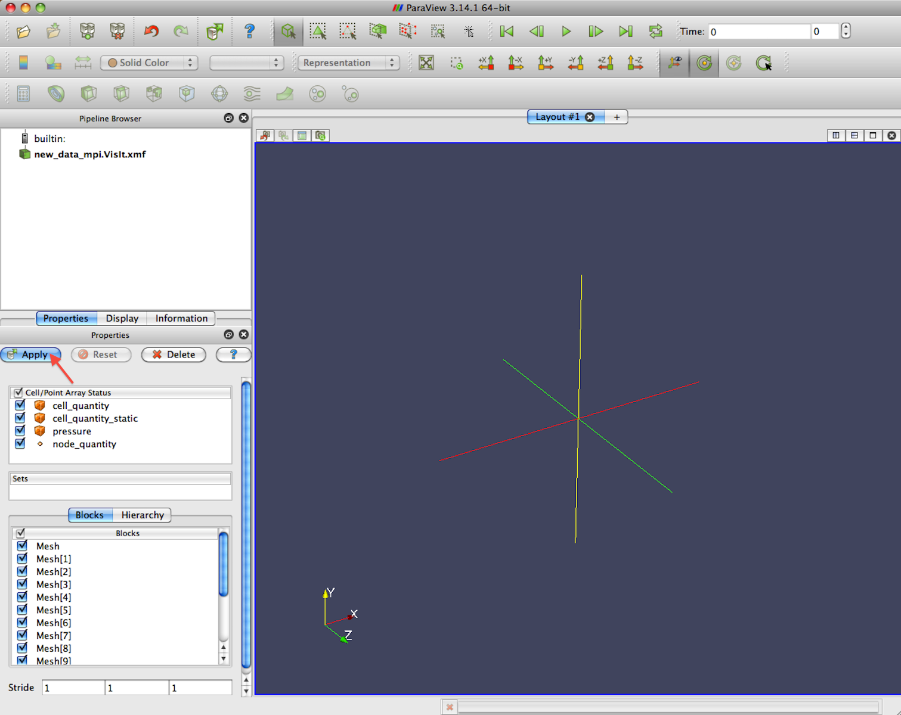
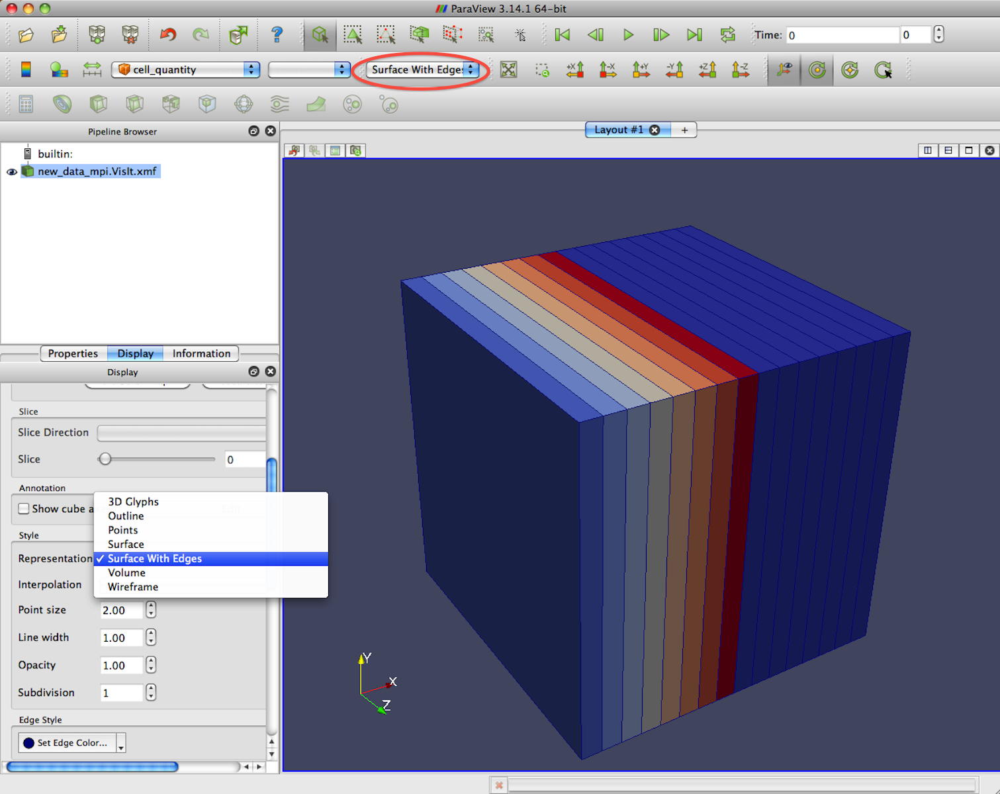
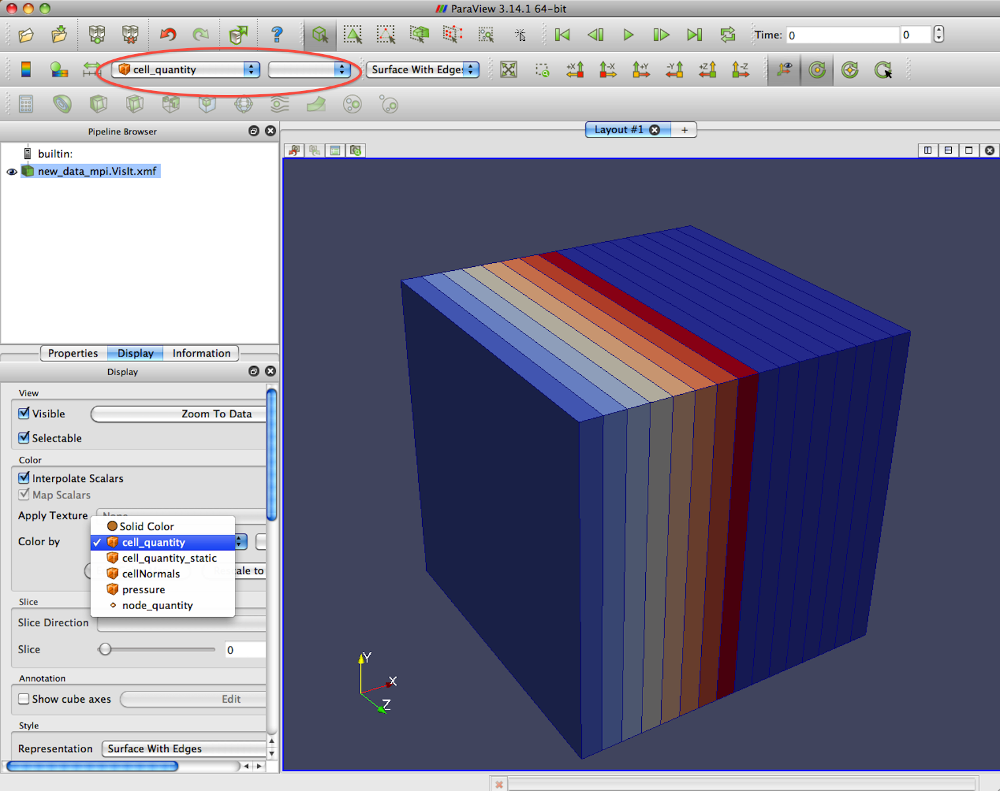
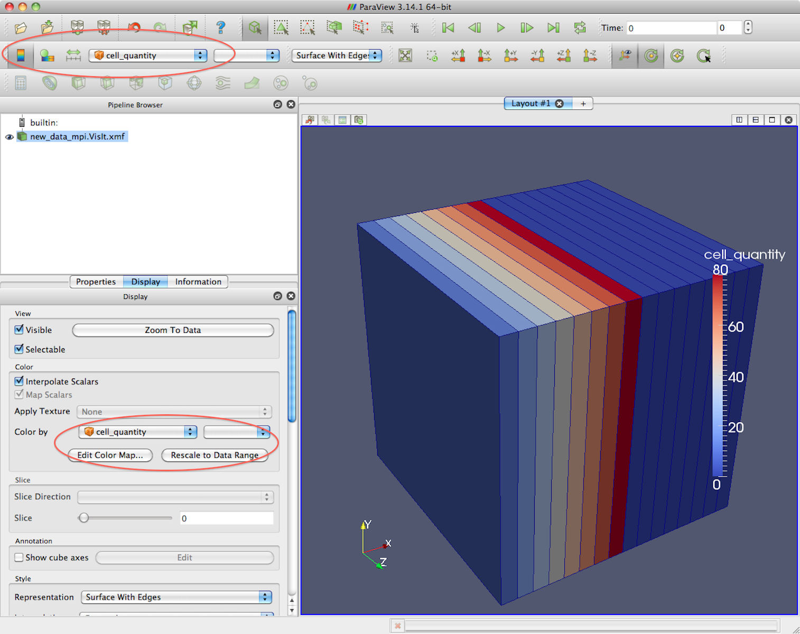

.. paraview

========
ParaView
========

.. _website: http://paraview.org
.. _wiki: http://paraview.org/Wiki/ParaView

ParaView is an open-source, multi-platform data analysis and visualization application.  It was developed by the Advanced Simulation and Computing (ASC) project with participation from Los Alamos Nation Lab, Sandia National Labs, Army Research Laboratory, and Kitware.

At the time of this Amanzi release, the visualization output files were tested using ParaView 3.14.1. There are known issues with the Xdmf reader in version 3.10.0.  Those issued were fixed with bug release 3.10.1.

Installation
------------

Executables and source code are available at the ParaView website_.  ParaView has a fairly extensive wiki_ as well.  The latest version of the User's Guide is available on the wiki page.  ParaView has readers for Xdmf, Exodus, netCDF, EnSIght, Tecplot, PFLOTRAN, and many more.  

Building from source is only recommended for advanced users and developers.  Pre-built binaries are available for Linux, Windows, and Mac.

Simple How To's
---------------

Open a file
+++++++++++

Click the file icon or select File->Open from the menu bar. Select your data file. Then select Apply in the Properties panel of the Object Inspector (default location, left side below the Pipeline Browser). Once a file is open it will appear in the Pipeline browser. Filters applied will appear below the filename. Double clicking on the name always the user to edit the name.  This is useful for clarity but will not actually change the name of the source file.  The eye icon next to each item will turn the display on and off. 

   After selecting file to open, click the Apply button in the Properties Window.

ParaView no longer treats sequentially named xmf files as single database. To view multiple time steps or create animations, open the <basename>.VisIt.xmf file. The collection file `*`.VisIt.xmf links to all of the individual timestep files `*`.h5.#.xmf.  The # indicates the sequential ordering of the timestep files. The individual timestep files are snippets of Xdmf rather than complete Xdmf files; therefore, ParaView does not automatically identify the file format.  When opening an individual timestep file, the user will be presented with a list of file formats, select Xdmf and ParaView will continue with reading the file.

Close file
++++++++++

To close a file or remove a filter, select the item in the Pipeline browser and select Delete in the Object Inspector Properties panel.

Displaying the Mesh
+++++++++++++++++++

The Pipeline Browser shows the current models and applied filters available for display.  Any listed items with an eye icon are currently visible.  The item in the list that is highlighted is the currently selected item.  Any selections in other menu will effect this item.

Select the item in the Pipeline Browser you wish to display the mesh for.  From the Display window scroll down to the Style panel.  Select "Surface With Edges" from the Representation list.  The Representation list is also available in the Toolbar at the top of the ParaView window.  The default value is "Surface".

   Display the mesh edges by selecting "Surface With Edges" in the Style panel of the Display window or in the Style Toolbar (indicated by red circle).

Display Field
+++++++++++++

Select the item in the Pipeline Browser you wish to display a field for.  Any filters selected will affect the highlighted item in the Pipeline Browser.  From the Display window scroll down to the Color panel.  Select the field name from the "Color By" list.  The  "Color By" list is also displayed in the Toolbar at the top of the ParaView window.

   Display a field by selecting the field from the "Color By" drop down list in the Color panel of the Display window or the Toolbar at the top (indicated by red circle).

Display Color Contour Bar
+++++++++++++++++++++++++

Select the color contour icon from the Toolbar at the top of the ParaView window.  The color bar can be modified and data range rescaled using the neighboring icons.  These options are also available from the Display window in the Color panel.

   A color scale can be added using the options in the Color panel of the Display window.  These options are also accessible in the Toolbar at the top.

Animation
+++++++++

VCR Control icons are shown in the upper right by default along with the time value and step id. These can be used to advance through a given series.

To create a coherent movie, it is often useful to scale the color contours for the entire time range.  To do this select "Edit Color Map" either from the top toolbar or the Color panel of the Display window.  The Color Scale Editor contains the option "Rescale to Temporal Range".  This will determine the data range for each time step and determine a scale ranging from the minimum to the maximum found.

To save the animation, select "Save Animation" from the File Menu.  Select options on the Animation Settings Dialog and click Save Animation.  Next, select the location to save the animation.  It will be saved as a series of individual files.  The individual images can be assembled into a movie using another application, such as iMovie on Mac or Gifsicle on linux.
