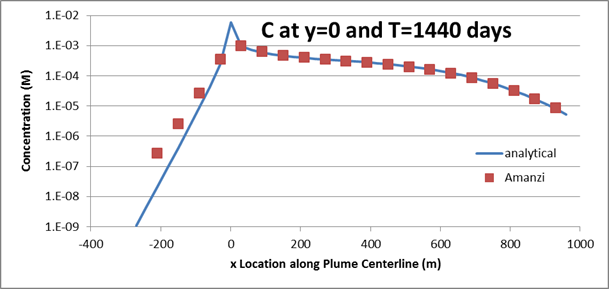
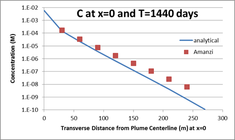
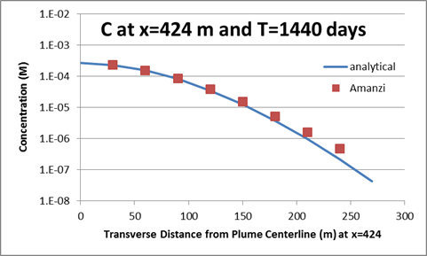

2D Dispersive Transport in a Uniform Flow Field
===============================================

Introduction
~~~~~~~~~~~~
This test problem is motivated by confined flow applications with transport 
from a relatively small source.  
A typical source would be a well that is fully screened over the confined flow interval.  
In this case, the steady-state flow field is uniform and the mass source rate 
does not affect the flow field.  
The dominant transport processes are advection and dispersion.  
Dispersion results in the spreading of the released mass in all directions 
including upstream of the source location.   
Longitudinal dispersivity (in the axis of flow) is typically several 
times larger than the transverse dispersivity.  
Accuracy of the simulated concentrations in the vicinity of the source 
is sensitive to the resolution of the grid and the numerical transport scheme.  

This two-dimensional transport problem for a constant rate mass loading point 
source in a steady-state flow field tests the Amanzi advection and dispersion process kernels.  
Options tested include specified velocity field, constant mass loading rate 
source term, advection, longitudinal and transverse dispersivities, and nonuniform gridding.
The analytical solution uses Green's functions to integrate solutions for point and 
line sources in each of the principle coordinate directions to generate 
advective-dispersive transport from a point, line, planar, or rectangular sources.  
The verification data used in this test is generated from AT123D, a program of 
these analytical solutions for one-, two-, or three-dimensional transport of 
heat, dissolved chemicals, or dissolved radionuclides in a homogeneous 
aquifer subject to a uniform, stationary regional flow field (Yeh, 1981). 
The assumption is that the modeled aquifer is infinite in the direction of 
flow but can be considered finite or infinite in the vertical and 
transverse horizontal directions. 
The test problem specification is described in (Aleman, 2007) as Problem 5.2.  
The verification data from AT123D that is used to compare against Amanzi 
output is listed in Tables 5.2.3, 5.2.4, and 5.2.5 of that document.

The analytical solution addresses the advection-dispersion equation 
(saturation :math:`s_l = 1`):

.. math::
  \phi \frac{\partial C}{\partial t} 
  = Q + {\rm div}(\boldsymbol{D} \nabla C),

where :math:`\boldsymbol{D}` is the dispersion tensor

.. math::
  \boldsymbol{D} = \begin{pmatrix}
  D_{xx} & D_{xy} \\[0.5ex]
  D_{yx} & D_{yy}
  \end{pmatrix}.

Let :math:`\boldsymbol{v} = (v_x,\,v_y)` denote the pore velocity,
:math:`\tau` the torsuosity, and :math:`D_m` the molecular diffusion.
Then the diagonal entries in the dispersion tensor are

.. math::
  D_{xx} = \alpha_L \frac{v_x^2}{\| \boldsymbol{v}\|}
  + \alpha_T \frac{v_y^2}{\| \boldsymbol{v}\|}
  + \phi \tau D_m, 
  \qquad
  D_{yy} = \alpha_L \frac{v_y^2}{\| \boldsymbol{v}\|}
  + \alpha_L \frac{v_x^2}{\| \boldsymbol{v}\|}
  + \phi \tau D_m.

The off-diagonal entries are

.. math::
  D_{xy} = D_{yx} 
  = (\alpha_L - \alpha_T) \frac{v_x\, v_y}{\| \boldsymbol{v}\|}.

Schematic
~~~~~~~~~
Note, the values in the schematic correlate to the values found in
:ref:`Plot-Table`.

.. figure:: schematic/schematic.png 
    :figclass: align-center

    **a) Plume from point source loading in a constant uniform groundwater flow field. b) Problem domain.**
                    
.. _Variables:
        

Defining Variables
~~~~~~~~~~~~~~~~~~
* :math:`Q=8.1483 \cdot 10^{-8}` constant pumping rate [kg/s/m]
* :math:`\boldsymbol{q}=(1.8634 \cdot 10^{-6},\,0.0)` constant Darcy velocity [m/s]
* :math:`\phi=0.35` constant porosity
* :math:`\alpha_L=21.3` longitudinal dispersivity [m]
* :math:`\alpha_T=4.3` transverse dispersivity [m]
* :math:`D_m=0.0` molecular diffusion coefficient [m^2/s]
* :math:`T=1400` simulation time [d]

Initial condition: :math:`C(x,0)=0` [kg/m^3]

Boundary conditions: :math:`C(x,t)=0` [kg/m^3]

The background mesh consists of square cells with size :math:`H=15` m.
It has 84 grid cells in the x-direction and 37 grid cells in the y-direction. 
The mesh is gradually refined toward the source such that the well is
represented by a square cell of :math:`h=0.46875` [m] (:math:`h = H/32`).
The mesh refinement adds 17% more cells.

.. figure:: figures/mesh.png 
    :figclass: align-center

    **Computational mesh with 3650 cells.**

Results and Comparison
~~~~~~~~~~~~~~~~~~~~~~
The plume structure is characterized by three line cuts.
The first cut is given by line :math:`y=0` that goes through the well.
The two other cuts are given by lines :math:`x=0` and :math:`x=424`.

    **Concentration along plume centerline (y=0) from upgradient to downgradient**

    **Concentration transverse to the flow field from plume centerline at x=0.**

    **Concentration transverse to the flow field from plume centerline at x=424.**

References
~~~~~~~~~~

Aleman, S. 2007. PORFLOW Testing and Verification Document. Savannah River National 
Laboratory technical report WSRC-STI-2007-00150 Rev 0. 193 p.

Yeh, G.T. 1981. AT123D: Analytical transient one-, two-, and three-dimensional 
simulation of transport in the aquifer system, Oak Ridge National Lab., Tennessee, Report No. ORNL-5602.

