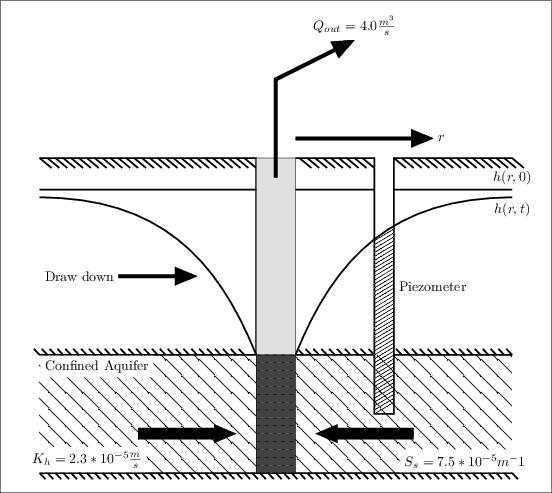
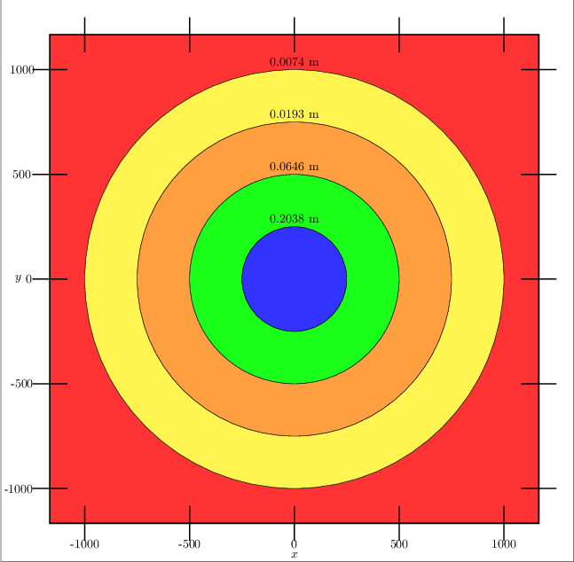

.. _Theis:

Theis Analysis
===============

Introduction
-------------

Theis (1935) developed an analytical solution for transient (non
steady state) drawdown for a fully penetrating well by imposing the
boundary conditions: :math:`h = h_0` for :math:`t = 0` and 
:math:`h \Rightarrow h_0` as :math:`r \Rightarrow \infty`.  The equation
assumes an infinite and uniform confined aquifer.  When a well is
pumped the water table declines toward the well and flow is induced
toward the well from all directions. Theoretically, this flow can be
idealized by purely radial symmetric flow and can be decribed by the
equation below (this is analogous to heat flow by conduction developed
by Fourier)

.. math:: 
     \frac{\partial^2 h}{\partial r^2} 
   + \frac{1}{r} \frac{\partial h}{\partial r} 
   = \frac{S}{T} \frac{\partial h}{\partial t}
          

The analytical solution of drawdown as a function of time and distance
is found to be:

.. math:: s = h(r,0) - h(r,t) = \frac{Q W(u)}{4 \pi T} 
   = \int_u^\infty \frac{exp[-\tau]}{\tau} d\tau = \frac{Q W(u)}{4\pi T}

where, 

.. math:: u(r,t) = \frac{r^2 S}{4 T t}

and the integral approximation for the well function, *W(u)*, for :math:`0 < u < 1` is  

.. math::
      W(u) = -0.577 - log(u) + .99 u - 0.2499 u^2 +0.055 u^3 - 0.00976 u^4 +
      0.00108 u^5
   
and for :math:`u \geq 1`,

.. math:: W(u) =(\frac{exp[-u]}{u})  \frac{u^4 +8.57333 u^3  +18.05902
	  u^2 + 8.63476 u +  0.26777}{u^4 + 9.57332 u^3 + 25.63296
	  u^2 + 21.09965 u + 3.95850}  

Note, :math:`W(u)` can easily be determined from existing tables once
:math:`u(r, t)` is found which is a measure of aquifer response time. For a
given value of *t* one can construct a draw down curve with respect to
the distance from the pumping well, *r*. 

Schematic
~~~~~~~~~~~~
Note, the values in the schematic correlate to the values found in
:ref:`Plot-Table`.

    **Figure 1.2 Illustration of transient drawdown**
		    
.. _Variables:
        
Defining Variables
~~~~~~~~~~~~~~~~~~~~

* *Q* constant pumping rate
* :math:`h(r,0)` initial water table table height
* *T* transmissivity 
* *W(u)* well function
* *r* radial distnace measured outward from well
* *S* storage coefficient 
* *t* duration of pumping time

Model
-----

Groundwater resource evaluation is crucial to understanding the
concept of groundwater yield. This concept is vital because it helps
determine the maximum allowable pump rate out of an aquifer and aid in
the understanding of the consequnces on the water table.  For example,
pumping water out of the water table (unconfined aquifer) may dry up
near by wells due to the fall in the saturated thickness of the
aquifer. This can be prevented by modeling the fall of the water table
given a certain pumping rate.

Confined Aquifer
~~~~~~~~~~~~~~~~

For Theis analysis to applicable three parameters must be known:

* *T*, transmissivity
* *S*, storativity
* *Q*, constant pumping rate

Transimissivity is defined as 

.. math:: T = Kb

where *K* is the hydraulic conductivity of the aquifer and *b* is the
saturated thickness.  Transmissivity values greater than 0.015
:math:`\frac{m^2}{s}` represent aquifers capable of well exploitation.
Storatvity is a dimensionless parameter that describes the amount of
water released by the aquifer per unit volume of the aquifer.
Storativity can be calculated using

.. math:: S = S_s b

where :math:`S_s` is the *specific storage* unique to each aquifer.
Again, *b* is the saturated thickness of the aquifer.  Specific
storage represents the volume of water released per unit volume of the
aquifer per unit decline in hydraulic head.

Lastly, the constant pumping rate, *Q*, is the volume of water
discharged from the well per unit time.

Unconfined Aquifer
~~~~~~~~~~~~~~~~~~

Note, there are multiple models to estimate the drawdown in unconfined
aquifers with varying degrees of certainty.  An important difference
between a confined and an unconfined aquifer is the hydraulic
gradients that are created.  This desrcibes how the water is flowing
in the aquifer to the well.

For example, the flow in a confined aquifer is purely horizontal and
no dewatering of the geologic system occurs.  The mechanisms for water
production in these wells are 1) expansion of the water and 2)
compaction of the aquifer.

However, in an unconfined aquifer there is both an induced horizontal
and vertical flow.  The water produced in these wells come from
confined delivery and the dewatering of the unconfined aquifer.
Hence, there is a new dimensionless coefficent of storage called
*specific yield*.  This paramter is always far greater than the
storativities of confined aquifers.

There are three approaches to estimate the cone of depression for an
unconfined aquifer.  The three approaches are:

1. saturated-unsaturated flow system in which water table drawdowns
   are accompanied by a change in the unsaturated moisture content
   above the water table
2. Delayed water table response
3. Confined aquifer equation (Theis)

It is important to note that when using the third option the specific
yield term is used rather than the storativity coefficient, *S*.  Also
the saturated thickness, *b* is considered to be the initial height of
the water table.

.. _Plot-Table:

Plot and Table of Analytic Solution and Amanzi Results
~~~~~~~~~~~~~~~~~~~~~~~~~~~~~~~~~~~~~~~~~~~~~~~~~~~~~~~

.. plot:: prototype/transient-theis/amanzi_transient_theis.py

.. include:: table_values_theis.txt

Note, this is an image of contour lines of constant draw down measured
at 35,000 seconds after pumping begins.  

