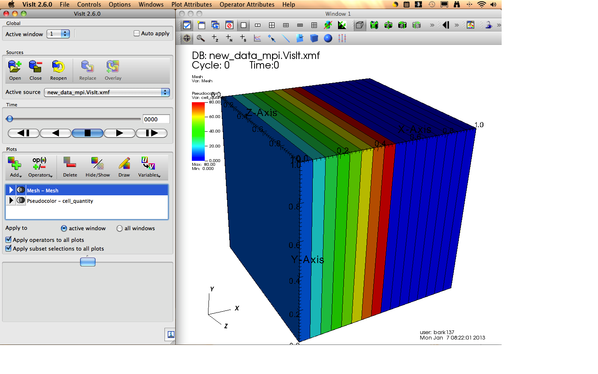
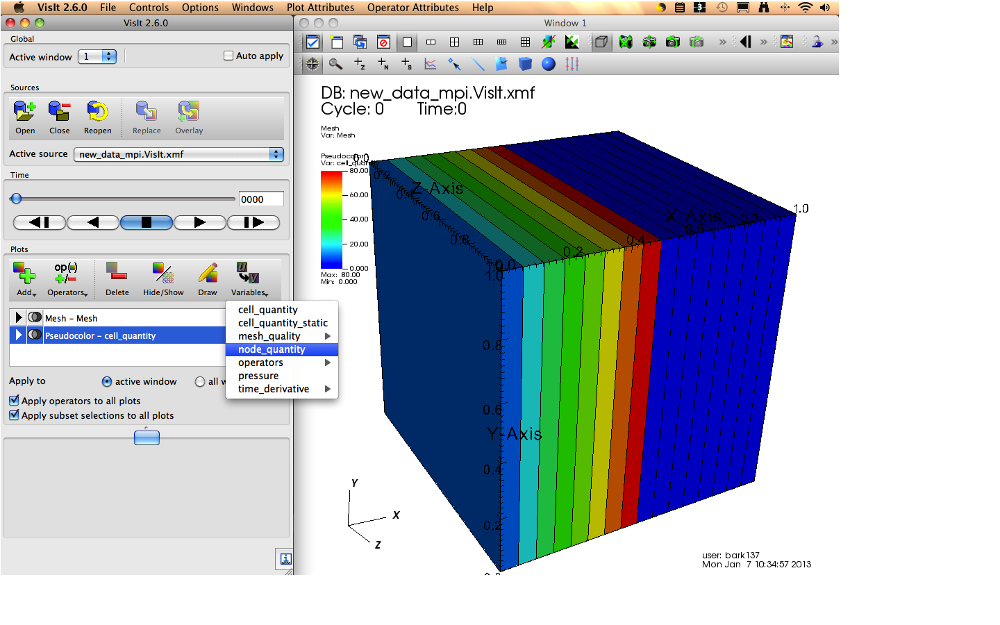

.. visit:

=======
VisIt
=======

.. _visit_home: https://wci.llnl.gov/codes/visit/
.. _visit_wiki: http://www.visitusers.org
.. _visit_source: https://wci.llnl.gov/codes/visit/source.html
.. |here| replace:: visit_source

VisIt is a free interactive parallel visualization and graphical analysis tool for viewing scientific data.  It was developed by the Department of Energy (DOE) Advanced Simulation and Computing Initiative (ASCI). Additional information about VisIt is available at visit_home_.

At the time of this Amanzi release visualization output files were tested with VisIt version 2.6.0.

The following discuss the installation of VisIt and several simple How To's.

Installation
------------

Executables and source are available at visit_home_.  A wiki is also available with documentation at visit_wiki_.  It is highly recommended that users install a pre-built binrary.  The binaries include readers for Xdmf, GMV, Exodus, netCDF, EnSight, Tecplot, and many more.  The binary for Mac OS X, starting with VisIt 2.0, includes the parallel engine compatible with the default MPI.  All other binaries are serial only.

Building from source is only recommended for advanced users and developers and those requiring parallel installation. VisIt provides a separate build_visit script that will download, configure, and install the required TPLs and VisIt executable.  This method does not allow the user to link to existing installations of any of the TPLs but guarantees that the TPL installations have the appropriate options selected.  VisIt can also be built from scratch step by step.  This allows the user to link to existing installation of TPLs.  While this will decrease the installation size, the TPL options required by VisIt may not match the user's current installation. 

The next section describes the options required for building VisIt using build_visit.  A set of simple How To's are giving in the final section.

Installation via build_visit
++++++++++++++++++++++++++++

Begin by downloading the build_visit script from visit_source_. The script will download and install the required TPLs.  It will also download the associated VisIt source code.  The most recent build_visit script can be downloaded at the top of the page.  The file will be saved as build_visit#_#_# indicating the VisIt version number.  Older versions of the source code and corresponding build_visit scripts are listed on the page as well.

Build_visit uses Whiptail to provide a visual interface.  This is not available on all platforms.  To skip the Whiptail interface and execute from the command line use the option ``--console``.  

Amanzi requires the Xdmf reader.  While the Xdmf is a built-in reader in the pre-built binaries, it is not built by default by build_visit.  The Xdmf reader also requires HDF5 built with szip.  Therefore the options ``--xmdf --hdf5 --szip`` are required.

To create the parallel engine required for a parallel installation use the ``--parallel`` option.

The final command line for building with the Xdmf reader and parallel looks like::
    
    sh build_visit#_#_# --console --xdmf --hdf5 --szip --parallel

After calling build_visit, the script will ask to for a response to accept the licensing.  Type ``yes`` to accept the licensing of VisIt and any TPLs.  

The script will continue to install the TPLs and then build VisIt.  This will take some time to complete.

Note, on Mac OS X the user may need to explicitly set the location of the default mpi installation.  For example, using::

    export PAR_COMPILER=/usr/bin/mpic++
    export PAR_INCLUDE="-I/usr/include"

Installation Troubleshooting
++++++++++++++++++++++++++++

The following are a few common issues when building VisIt via build_script.

1. Rebuilding VisIt.

   build_visit utilizes CMake.  Configuration options are stored in the file ``CMakeCache.txt`` in the root directory.  To do a clean build including rerunning the configure step remove this file.

2. Undefined reference to 'mglClearColor' or other 'mgl' library.

   Add the ``--mesa`` option to build Mesa.
   Also, you may need to remove the VTK installation to incorporate Mesa.  Remove the directories ``visit-vtk`` and ``visit/vtk``.

Simple How To's
---------------

Documentation of VisIt can be found at the main website (visit_home_) as well as the associated user's wiki page (visit_wiki_).  Below are a series of simple How To's to get the user going with VisIt. 

Launch VisIt
++++++++++++

To launch from the command line execute /path/to/install/bin/visit.  If you used the dmg installer on Mac OS X, a link was added to the Application list.

When launched from the command line, VisIt will display the current directories contents when opening a source.  It can be useful to launch VisIt from the directory containing the output you wish to visualize.

VisIt consists of two windows.  First is the Main window where menus and options can be accessed from.  Second is the visualization window.  Additional visualization windows can be created as the user needs.

   The left window is the Main window.  The right window is the Visualization window.

Open Visualization File
+++++++++++++++++++++++

Select File->Open or click the Open icon in the Sources Panel in the Main window.  Maneuver to the directory containing the simulation output you wish to visualize.  Select the file <basename>.VisIt.xmf to visualize the full time series of output.  Individual time steps are written to files named <basename>.h5.#.xmf, where # indicates the sequential ordering of the files.  When opening a source, the sequentially names series of files are grouped as a single database.  To open an individual time step file, toggle File Grouping to Off and then select the file.  Selecting the grouped files will open the entire series.

The Active source bar contains a list of open sources.  It also displays the currently active source file.  If a sequentially named series of files exist, the entire series will be opened as a single database. 

Displaying the Mesh
+++++++++++++++++++

To add a plot to the visualization window, click the Add icon in the Plots panel.  A list of plot types and their subcategories will appear.  Mesh is one of these plot types.

To display the mesh, click the Add icon and highlight Mesh.  This will list the mesh quantities available.  The entire mesh is labeled Mesh.  Any subregions included will also be listed.  After selecting the mesh group Mesh - Meshname will be listed in the window below.  To visualize the mesh, click the Draw icon.

To toggle between showing and hiding the mesh, select Mesh in the plot panel window and click the Hide/Show icon.

To switch between different mesh regions available, click the Variables icon and select from the drop-down list.

.. figure:: figs/visit_mesh.png 
   :align: center

   Adding a Mesh Plot.

Displaying Fields
+++++++++++++++++

To add a plot to the visualization window for a field, click the Add icon in the Plots panel.  The available plot types will be in bold.  Typical color contours are achieved by selecting Pseudocolor and the desired field name.  Next click the Draw icon to display the plot.  To switch between available fields, click on the Variables icon and select from the drop-down list.

.. figure:: figs/visit_psuedo.png 
   :align: center

   Adding a Psuedocolor Plot.

   Changing the variable displayed with the Psuedocolor Plot.

Animation
+++++++++

The main window contains a Time panel.  If multiple time steps exist the user can step through the time steps using the play buttons.  The sequential step numbers are displayed next to the slider.  The time value is displayed in the upper left corner of the visualization window.

Closing Sources
+++++++++++++++

Before a source can be closed, all associated plots must be deleted.  Select the plot listed in the Plots panel and click the Delete icon.  After deleting all of the plots utilizing the source, select the source in the Active source list and click the Close icon.

