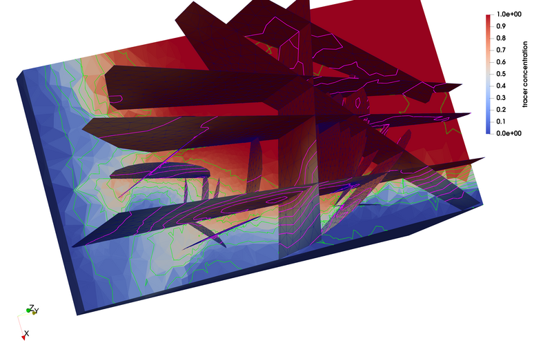
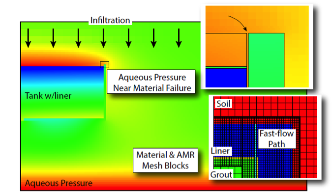

Introduction
============

Amanzi provides a flexible and extensible parallel flow and reactive
transport simulation capability for environmental applications. It
includes general polyhedral mesh infrastructure, which leverages MSTK,
advanced discretizations of process models, including traditional
finite volume schemes, mimetic finite differences, and nonlinear
finite volumes. In addition, it provides advanced nonlinear solvers,
such as Nonlinear Krylov Acceleration (NKA) and Anderson Acceleration,
and leverages Trilinos-ML and Hypre Algebraic Multigrid for scalable
solvers. The reaction of contaminants and minerals carried by the flow
through the surrounding rock and soil is modeled through a general
software interface called Alquimia that allows Amanzi to interface
with a variety of powerful geochemistry engines including PFLOTRAN and
CrunchFlow. 

.. image:: figures/farea-composite-white-2006.png
   :width: 35%                               

The code is parallel and leverages open-source parallel
frameworks such as Trilinos, PETSc. Amanzi has been used to model
contaminant migration at various DOE waste sites (e.g., Nevada
National Security Site, and Savannah River), and is generally
applicable to groundwater contaminant migration under partially
saturated, nonisothermal conditions and its interaction with surface
water.

The multiphysics framework in Amanzi is called Arcos, and it provides
modelers with the flexibility they need to creatively decompose
complex problems and explore a variety of mixed-dimensional model
configurations to develop understanding and make predictions of
environmental systems. In particular, Arcos provides flexibility for
hierarchical weak and strong coupling of processes with subcycling of
mixed dimensions. This capability in conjuction with Amanzi's powerful
mesh infrastructure, which supports the splitting and subsetting of
meshes, enables creative conceptual modeling. Applications in Amanzi
include, coupling flow and transport on discrete-fracture-networks
(DFNs) and the background matrix, while applications in the `Advanced
Terrestrial Simulator (ATS) <https://amanzi.github.io/ats>`_ include,
integrated hydrology coupling surface and subsurface processes; and an
intermediate scale thermal hydrology model of polygonal tundra based
on one-dimensional columns coupled to the two-dimensional surface.

Releases and Documentation
==========================

Current Release
~~~~~~~~~~~~~~~~~~~~~~~~~~~~~~~~~~

 * Amanzi |release|: `<UserGuide>`_
   | `Branch on Github <https://github.com/amanzi/amanzi/tree/amanzi-1.4>`_
   | `amanzi-1.4.0.tar.gz <https://github.com/amanzi/amanzi/archive/refs/tags/amanzi-1.4.0.tar.gz>`_

 
Previous Releases
~~~~~~~~~~~~~~~~~

 * Amanzi 1.3.0:
   `UserGuide <1.3.0/UserGuide>`_
   | `Branch on Github <https://github.com/amanzi/amanzi/tree/amanzi-1.3>`_
   | `amanzi-1.3.0.tar.gz <https://github.com/amanzi/amanzi/archive/refs/tags/amanzi-1.3.0.tar.gz>`_
 * Amanzi 1.2.0:
   `UserGuide <1.2.0/UserGuide>`_
   | `Branch on Github <https://github.com/amanzi/amanzi/tree/amanzi-1.2>`_
   | `amanzi-1.2.0.tar.gz <https://github.com/amanzi/amanzi/archive/refs/tags/amanzi-1.2.0.tar.gz>`_

Ongoing Development
~~~~~~~~~~~~~~~~~~~

You can track and contribute to development of the next release.  Capabilities we are working on include a prototype of non-isothermal multiphase flow with phase disappearence.  

 * Amanzi 1.5-dev:
   `UserGuide <dev/UserGuide>`_
   | `Branch on Github <https://github.com/amanzi/amanzi/>`_
 

User Guide
===========

The User Guide is best viewed on the web 
`[html] <UserGuide>`_.

Downloads
==========

Source code releases are availble from the Amanzi Github
`Releases <https://github.com/amanzi/amanzi/releases>`_.

System and Software Requirements
=================================

Amanzi is written in C++,C, and Fortran, and is readily built on
modern Linux/Unix systems, including Ubuntu, RedHat Enterprise, and
CentOS, as well as Mac OSX.  There are a large number of Third Party
Libraries that it uses, so to make the build process easier Amanzi's
build system will download and build all the TPLs for you.  To get
started you will need a modern Linux/Unix/OSX system with

 * CMake (version >= 3.17.0), 
 * A recent GNU >= 7.5, Clang >=5, or Intel compiler >= 19, suporting the C++14 standard.
 * MPI (e.g., OpenMPI version > 3.1)

Details are provided in the Installation Instructions in the User Guide.

Open Source / Open Development
===============================

Amanzi is developed and distributed under the three-clause BSD
open-source license.  Copyright is held jointly by the contributing
laboratories (LANL,LBNL,ORNL,PNNL). Included in the Amanzi source code is
the growing set of unit, integration, regression, and benchmark tests
that are used by the development and application teams.

