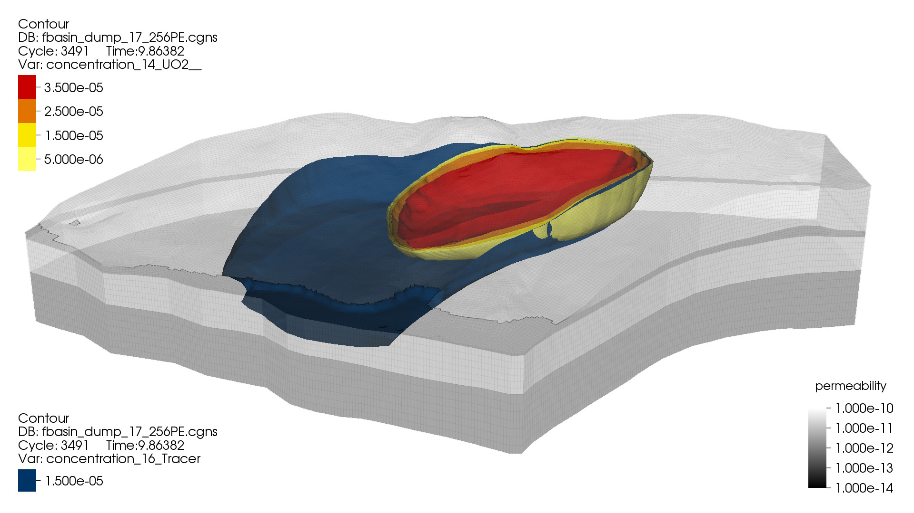

Introduction
============

The Advanced Simulation Capability for Environmental Management
(ASCEM) program is developing a suite of open-source tools and
state-of-the-art approach for integrating data and scientific
understanding to enable prediction of contaminant fate and transport
in natural and engineered systems.  This multi-lab program is
supported by the Department of Energy (DOE) Office of Environmental
Management (EM) to provide scientifically defensible and standardized
assessments of the uncertainties and risks associated with the
environmental cleanup and closure of its waste sites.

.. image:: figures/fig-5_0050.png            
   :width: 30% 
.. image:: figures/WasteTank-AMR.png
   :width: 30%

The ASCEM Platform, Akuna, supports and streamlines the process of
creating ensembles of conceptual models to quantify the associated
uncertainty, sensitivity, and risk in these systems. These conceptual
models will span a range of process complexity, potentially coupling
hydrological, biogeochemical, and geomechanical processes.  Amanzi, is
the flexible and extensible computational engine that simulates the
coupled process and flow scenarios described by these conceptual
models. Amanzi, is a parallel flow and reactive transport simulator
that supports transient and steady-state saturated and unsaturated
flows, and wide variety of geochemical reactions.

Quality Assurance: Basic Phase Release
======================================

The development of Amanzi is following a risk-based graded approach to
meet its Quality Assurance requirements (NQA-1).  This graded approach
will use three phases of development in conjunction with an agile
test-driven approach to maturing capabilities through a series of
site-based demonstrations and automated hierarchical testing.
Specifically, the Research and Development branch (R&D) corresponds to
the NQA-1 “Basic Phase”, while the “Community Code” phase requires
additional rigor in support of the NQA-1 “Applied Research” and
broader use in the community. Finally, application of appropriate QA
rigor will support the “Development Phase” and release of ASCEM as a
tool for regulatory work, which is targeted for late 2015.

To ensure that new advances in algorithms, geoscience, computer, and
computational science can advance quickly to future regulatory
releases, all three phases of development will co-exist in the future.
However, at this early stage only the R&D code branch (Basic Phase)
exists.  This release of Amanzi is from the R&D branch and is intended
to open communication and build collaborations with potential users at
DOE waste sites, universities and industry.

Release Schedule
================

The current version of Amanzi is |version|

Older Versions
~~~~~~~~~~~~~~

 * Not Yet

Future Releases
~~~~~~~~~~~~~~~

 * Updates to the Basic Phase Amanzi, including bug fixes and 
   capability enhancements, will be made regularly
 * First Applied Phase release of Amanzi (~version 0.90.0) 
   is targeted for late 2014.
 * First Development Phase (NQA-1) release of Amanzi (~version 1.0)
   is targeted for late 2015.

User Guide
==========

The User Guide is available 
`[PDF] <AmanziUserGuide.pdf>`_
or can be viewed directly on the web 
`[html] <UserGuide>`_.

Download
========

Goto the Amanzi :ref:`downloads` page.

System Requirements:
====================

Amanzi is written in C++,C, and Fortran, and is readily built on
modern Linux/Unix systems, including Ubuntu, RedHat Enterprise, and
CentOS, as well as Mac OSX.  There are a large number of Third Party
Libraries that it uses, so to make the build process easier Amanzi's
build system will download and build all the TPLs for you.  To get
started you will need a modern Linux/Unix/OSX system with

 * CMake (version >= 2.8.8), 
 * GNU compilers (gcc,g++,gfortran) version >= 4.7
 * MPI (e.g., OpenMPI version > 1.4)

Details are provided in the Installation Instructions in the User Guide.

Open Source
===========

Amanzi is developed and distributed under the three-clause BSD
open-source license.  Copyright is held jointly by the contributing
laboratories (LANL,LBNL,PNNL). Included in the Amanzi source code is
the growing set of unit, integration, regression, and benchmark tests
that are used by the development and application teams.

