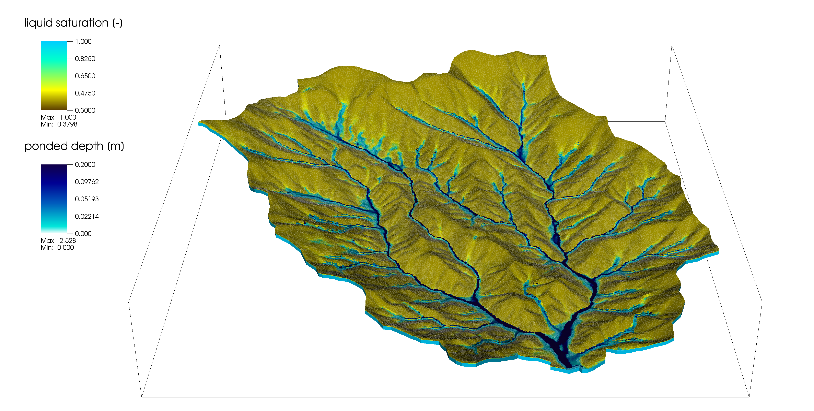

.. ATS documentation master file, created by
   sphinx-quickstart on Thu Mar 12 14:16:05 2020.
   You can adapt this file completely to your liking, but it should at least
   contain the root `toctree` directive.

Advanced Terrestrial Simulator
$$$$$$$$$$$$$$$$$$$$$$$$$$$$$$

The Advanced Terrestrial Simulator is a code for solving ecosystem-based, integrated, distributed hydrology.

Capabilities are largely based on solving various forms of Richards equation coupled to a surface flow equation, along with the needed sources and sinks for ecosystem and climate models. This can (but need not) include thermal processes (especially ice for frozen soils), evapo-transpiration, albedo-driven surface energy balances, snow, biogeochemistry, plant dynamics, deformation, transport, and much more.

ATS is a suite of physics processes built for Amanzi.  As such documentation is split between process documentation here and framework documentation in Amanzi.  Links across the related projects attempt to build a uniform interface for the user.

View our Gallery of Demo problems.

.. toctree::
   :maxdepth: 2
   :caption: User Guide:

   demos
   input_spec

..   
.. toctree::
   :maxdepth: 2
   :caption: Developers Guide:
             

Indices and tables
%%%%%%%%%%%%%%%%%%

* :ref:`genindex`
* :ref:`modindex`
* :ref:`search`
