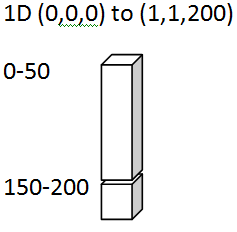

Sand Clay Layers
================

Capabilities Tested
-------------------

For details on this test, see :ref:`about_sand_clay`.

Background
----------

Verification problems from the literature have been identified to test
isothermal, single-phase, variably saturated flow.  We initially focus
on test problems that address the two most widely used k-s-p
functions, Mualem-van Genuchten :cite:`scinfil-Mualem_1976` :cite:`scinfil-vanGenuchten_1980` and Brooks-Corey :cite:`scinfil-brooks1964hydraulic`.  These include
steady-state and transient tests with Dirichlet and Neumann boundary
conditions.

This is documentation for the Amanzi run that is intended to compare
the results from Amanzi against the semi-analytical results documented
in "A set of Analytical Benchmarks to Test Numerical Models of Flow
and Transport in Soils." by J. Vanderborght,
et. al. http://vzj.geoscienceworld.org/content/4/1/206.abstract :cite:`scinfil-vanderborght2005set`.

This page is a summary of the first test case noted as the first line
in Table 3 of that paper.  It is three cases that are all
"Steady-state flux in layered soil profiles".  The difference between
the three cases is the fact the first case a is loam over sand, b is
sand over loam and c is clay over sand.  The labeling of the case is
based on the Figure 2. results so files and data associated with case
2a should match Fig 2. a in the Vanderborght paper.

Model
-----

Initial condition.
Pressure :math:`\psi` for all x (depths) and t=0: -200cm (assume cm Hg) = 81747 Pa

Boundary conditions. 
Flow at surface for all time:  .5 cm/d = 5.78703704E-8 m/s 
:math:`\partial \psi / \partial x` at 200cm depth=0

Problem Specification
---------------------

Schematic
~~~~~~~~~

Mesh
~~~~

Variables
~~~~~~~~~

Results and Comparison
----------------------

.. plot:: verification/flow/richards/steady-steate/infiltration_clay_sand_1d/amanzi_infiltration_clay_sand_1d.py
   :align: center

References
----------

.. bibliography:: /bib/ascem.bib
   :filter: docname in docnames
   :style:  alpha
   :keyprefix: scinfil-

.. _about_sand_clay:

About
-----

* Directory:  testing/verification/flow/richards/steady-state/infiltration_clay_sand_1d

* Author:  

* Maintainer:  David Moulton (moulton@lanl.gov)

* Input Files:

  * amanzi_infiltration_clay_sand_1d-u.xml

    * Spec Version 2.3, unstructured mesh framework
    * mesh:  generated internally 

