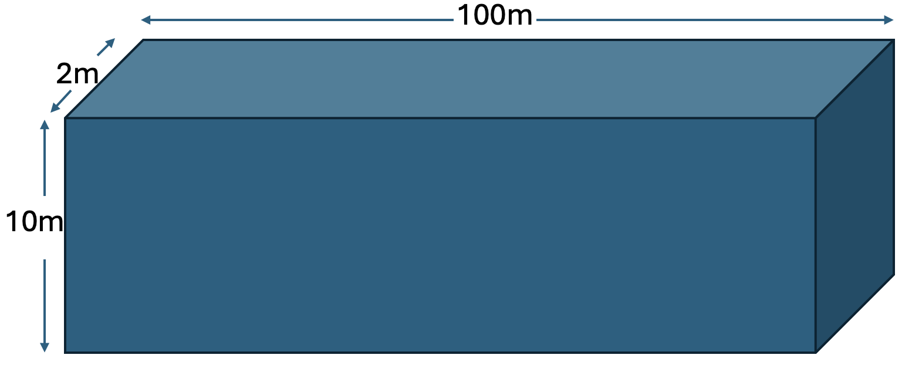

Steady-State One-Dimensional Flow with Flux and Head Boundary Conditions
========================================================================

Capabilities Tested
-------------------

This one-dimensional, steady-state flow problem tests the Amanzi saturated flow process kernel to
simulate flow through a homogeneous, saturated porous medium with constant properties. The 
analytical solutions for hydraulic head and volumetric flux (derived from Darcy's Law) can be used to test the Amanzi 
implementation of prescribed hydraulic head boundary conditions, prescribed flux boundary 
conditions, Darcy’s law :cite:`linfh-Darcy_1856`, and mass conservation for an elementary problem.
Capabilities tested include:

  * single-phase, one-dimensional flow 
  * steady-state flow 
  * saturated flow
  * constant-head (Dirichlet) boundary conditions
  * specified volumetric flux (Neumann) boundary conditions
  * homogeneous porous medium
  * uniform mesh 

  For details on this test, see :ref:`about_linear_flux_head_1d`. 

Background
----------

For one-dimensional, steady-state, flow through a saturated porous medium with constant properties, 
the general governing differential equation expressing mass conservation and Darcy's law becomes simply:

	.. math:: \frac{d^2h}{dx^2} = 0
		:label: ode_linear_flux_head

where the total head (:math:`h`, [L]) is the sum of pressure head (:math:`P/\rho g`, [L]) 
and elevation (:math:`z`, [L]):

	.. math:: h = \frac{P}{\rho g}+z

where :math:`\rho` = density [M/L\ :sup:`3`\ ], :math:`g` = gravitational acceleration [L/T\ :sup:`2`\ ], 
and :math:`x` = horizontal distance [L]. The ordinary differential equation :eq:`ode_linear_flux_head` is easily solved by 
direct integration as:

	.. math:: h = C_1 x + C_2
		:label: generalSoln_linear_flux_head

where the integration constants :math:`C_1` and :math:`C_2` depend on the boundary conditions.

Model
-----
The analytic solution for prescribed inlet flow and outlet pressure is given below.

When volumetric flux is prescribed at the inlet boundary :math:`x = 0` and 
hydraulic head at the outlet :math:`x = L` as:

	.. math:: 
		U(0) &= U_0\\
		h(L) &= h_L
		:label: bc_linear_flux_head

the analytic solution :eq:`generalSoln_linear_flux_head` for hydraulic head becomes:

	.. math:: h = \frac{U_0L}{K} (1 - \frac{x}{L})  + h_L
		:label: specificSoln_linear_flux_head

where :math:`L` = domain length [L]. For these boundary conditions the volumetric flow rate per unit area, 
or volumetric flux (:math:`U`, [L\ :sup:`3`\/L\ :sup:`2`\T]), is constant and defined by Darcy's law as:

	.. math:: U = -\frac{k}{\mu}\rho g \frac{dh}{dx} = -K\frac{dh}{dx} = -K\frac{-U_0}{K} = U_0
		:label: DarcyVel_linear_flux_head

where :math:`k` = intrinsic permeability [L\ :sup:`2`\ ],
:math:`\mu` = viscosity [M/LT], and 
:math:`K` = hydraulic conductivity [L/T]. 

Problem Specification
---------------------

The analytic solutions for hydraulic head and volumetric flux can be used to test Amanzi
implementation of prescribed hydraulic head boundary conditions, Darcy's law, and mass conservation
on an elementary problem. 

Schematic
~~~~~~~~~
The domain is shown in the following schematic.

    **One-dimensional, steady-state flow through a saturated porous medium.**

Mesh
~~~~

The numerical mesh has dimensions :math:`100 \text{ m } \times 2 \text{ m } \times 10 \text{ m}`. The mesh is
comprised of 20 cells with uniform discretization such that it contains 20 cells in the
x-direction, 1 cell in the y-direction, and 1 cell in the z-direction (:math:`\Delta x = 5 \text{ m}, \: \Delta y = 2 \text{ m}, \: \Delta z = 10 \text{ m}`).

Variables
~~~~~~~~~

To generate numerical results the following specifications are considered:

* Domain:

  * :math:`x_{min} = y_{min} = z_{min} = 0`
  * :math:`x_{max} = 100` m, :math:`y_{max} = 2` m, :math:`z_{max} = 10` m

* Horizontal flow in the x-coordinate direction:

  * no-flow prescribed at the :math:`y_{min}, \: y_{max}, \: z_{min}, \: z_{max}` boundaries
  * prescribed volumetric flux at the x-coordinate inlet: :math:`U(0) = 0.01 \text{ [m/d]}` 
  * prescribed hydraulic head at the x-coordinate outlet: :math:`h(L) = 19 \text{ [m]}`

* Material properties:

  * fluid density:    :math:`\rho = 998.2 \: \text{[kg/m}^3\text{]}`
  * dynamic viscosity:    :math:`\mu = 1.002 \times 10^{-3} \: \text{[Pa} \cdot \text{s]}` 
  * gravitational acceleration:    :math:`g = 9.807 \: \text{[m/s}^2\text{]}` 
  * hydraulic conductivity:    :math:`K = 1.0 \: \text{[m/d]}` 
    * (permeability:    :math:`k = 1.1847 \times 10^{-12} \text{ [m}^2\text{]})`

For these input specifications, Amanzi simulation output is expected to closely match

	.. math:: h = 20 -\frac{x}{100m} \text{ [m]}
		:label: expectedH_linear_flux_head

and

	.. math:: U = 1.0 \text{ [m/d]}
		:label: expectedU_linear_flux_head

following Equations :eq:`specificSoln_linear_flux_head` and :eq:`DarcyVel_linear_flux_head`.

Results and Comparison
----------------------
The discretization is exact for linear solutions, and it is clear in the figure that
Amanzi has reproduced the exact solution.

.. plot:: amanzi_linear_flux_head_1d.py
   :align: center

This is also visible in the following table:

.. include:: table_values.txt

References
----------

.. bibliography:: /bib/ascem.bib
   :filter: docname in docnames
   :style:  alpha
   :keyprefix: linfh-

.. _about_linear_flux_head_1d:

About
-----

* Directory: testing/verification/flow/saturated/steady-state/linear_flux_head_1d

* Authors:  Greg Flach (SRNL) and Marc Day (LBNL)

* Maintainer(s): David Moulton, moulton@lanl.gov

* Input Files:

  .. * amanzi_linear_flux_head_1d-s.xlm 

    .. * Spec Version 1.2.2, structured mesh framework
       * mesh:  steady-flow_mesh.h5

  * amanzi_linear_flux_head_1d-u.xml

    * Spec Version 2.3.0, unstructured mesh framework
    * mesh:  generated internally 

.. * Mesh Files:

  .. * steady-flow_mesh.h5

* Analytic solution computed with golden output

  * Subdirectory: golden_output

  * Input Files: 

    * steady-flow_data.h5

Status
~~~~~~

.. todo:: 

  * Documentation:

    * keb: find a schematic for this test
    * keb: amanzi_linear_flux_head_1d-s.xlm seems like an older format
    * keb: there is an extra xml in folder, is that used? amanzi_linear_flux_head_1d-s-isv2.xml
