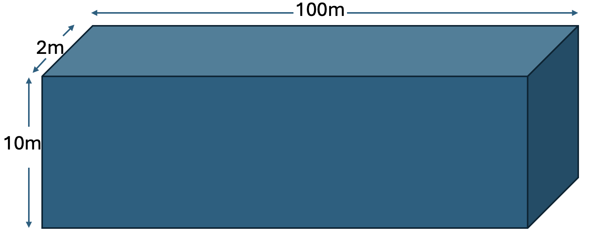

Steady-State One-Dimensional Flow with Head Boundary Conditions
===============================================================

Capabilities Tested
-------------------

This one-dimensional, steady-state flow problem tests the Amanzi saturated flow process kernel to
simulate flow through a homogeneous, saturated porous medium with constant properties. The analytical solutions for hydraulic head and Darcy velocity can be used to test the Amanzi implementation
of prescribed hydraulic head boundary conditions, Darcy's law :cite:`linhh-Darcy_1856`, and mass conservation for an 
elementary problem. 

Capabilties tested include:

  * steady-state, one-dimensional flow
  * saturated flow conditions
  * constant-head (Dirichlet) boundary conditions
  * mass conservation
  * exactness of numerical scheme for linear head
  * homogeneous porous medium

For details on this test, see :ref:`about_linear_head_head_1d`.

Background
----------
For one-dimensional, steady-state, flow through a saturated porous medium with constant properties, 
the general governing differential equation expressing mass conservation and Darcy's law :cite:`linhh-Darcy_1856` becomes simply

	.. math:: \frac{d^2h}{dx^2} = 0
		:label: ode_linear_head_head

where the total head (:math:`h`, [L]) is the sum of pressure head (:math:`P/\rho g`, [L]) 
and elevation (:math:`z`, [L])

	.. math:: h = \frac{P}{\rho g}+z

:math:`\rho` = density [M/L\ :sup:`3`\ ], :math:`g` = gravitational acceleration [L/T\ :sup:`2`\ ], 
and :math:`x` = horizontal distance [L]. The ordinary differential equation :eq:`ode_linear_head_head` is easily solved by 
direct integration as

	.. math:: h = C_1 x + C_2
		:label: generalSoln_linear_head_head

where the integration constants :math:`C_1` and :math:`C_2` depend on the boundary conditions.

Analytic solution for prescribed inlet and outlet pressures
~~~~~~~~~~~~~~~~~~~~~~~~~~~~~~~~~~~~~~~~~~~~~~~~~~~~~~~~~~~

Model
-----
The analytic solution for prescribed inlet and outlet pressures is presented below.
When hydraulic head is prescribed at both boundaries as

	.. math:: 
		h(0) &= h_0\\
		h(L) &= h_L
		:label: bc_linear_head_head

the analytic solution :eq:`generalSoln_linear_head_head` for hydraulic head becomes

	.. math:: h = (h_L - h_0) \frac{x}{L} + h_0
		:label: specificSoln_linear_head_head

where :math:`L` = domain length [L]. For these boundary conditions the volumetric flowrate per unit area, 
or Darcy velocity (:math:`U`, [L/T]), is defined by Darcy's law :cite:`linhh-Darcy_1856` as

	.. math:: U = -\frac{k}{\mu}\rho g \frac{dh}{dx} = -K\frac{dh}{dx} = K\frac{h_0 - h_L}{L}
		:label: DarcyVel_linear_head_head

where :math:`k` = intrinsic permeability [L\ :sup:`2`\ ],
:math:`\mu` = viscosity [M/LT], and 
:math:`K` = hydraulic conductivity [L/T]. 

Amanzi verification test problem
~~~~~~~~~~~~~~~~~~~~~~~~~~~~~~~~

Problem Specification
---------------------

Schematic
~~~~~~~~~
The domain is shown in the following schematic.

    **One-dimensional, steady-state flow through a saturated porous medium with constant properties.**

Mesh
~~~~

The numerical mesh has dimensions :math:`100 \: m \times 2 \: m \times 10 \: m`. The mesh is
comprised of 20 cells with uniform discretization such that it contains 20 cells in the
x-direction, 1 cell in the y-direction, and 1 cell in the z-direction (:math:`\Delta x = 5 \text{ m}, \: \Delta y = 2 \text{ m}, \: \Delta z = 10 \text{ m}`).

Variables
~~~~~~~~~

To generate numerical results, the following specifications are considered:

* Domain

  * :math:`x_{min} = y_{min} = z_{min} = 0`
  * :math:`x_{max} = 100` m, :math:`y_{max} = 2` m, :math:`z_{max} = 10` m

* Horizontal flow in the x-coordinate direction

  * no-flow prescribed at the :math:`y_{min}, \: y_{max}, \: z_{min}, \: z_{max}` boundaries
  * prescribed hydraulic head at the x-coordinate boundaries: 
    :math:`h(0) = 20 \: \text{[m]}, \: h(L) = 19 \: \text{[m]}`

* Material properties:

  * :math:`\rho = 998.2 \: \text{[kg/m}^3\text{]}`
  * :math:`\mu = 1.002 \times 10^{-3} \: \text{[Pa} \cdot \text{s]}` 
  * :math:`g = 9.807 \: \text{[m/s}^2\text{]}` 
  * :math:`K = 1.0 \: \text{[m/d]}` 
    (permeability: :math:`k = 1.1847 \times 10^{-12} \text{ [m}^2\text{]})`

For these input specifications, Amanzi simulation output is expected to closely match

	.. math:: h = 20 -\frac{x}{100} \text{ [m]}
		:label: expectedH_linear_head_head

and

	.. math:: U = 1.0 \text{ [m/d]}
		:label: expectedU_linear_head_head

following Equations :eq:`specificSoln_linear_head_head` and :eq:`DarcyVel_linear_head_head`.

Results and Comparison
----------------------
The discretization is exact for linear solutions, and it is clear in the figure that
Amanzi has reproduced the exact solution. 
On the boundary *Amanzi* takes the head value from a nearby cell. 
This could be fixed in the future.

.. plot:: amanzi_linear_head_head_1d.py
   :align: center

This is also visible in the following table:

.. include:: table_values.txt

References
----------

.. bibliography:: /bib/ascem.bib
   :filter: docname in docnames
   :style:  alpha
   :keyprefix: linhh-

.. _about_linear_head_head_1d:

About
-----
* Directory:  test_suites/verification/flow/saturated/steady-state/linear_head_head_1d

* Authors:  Greg Flach, Konstantin Lipnikov

* Maintainer(s):  David Moulton, moulton@lanl.gov

* Input Files:

  * amanzi_linear_head_head_1d-s.xml 

    * Spec Version 2.3.0, structured mesh framework
    * mesh:  steady-flow_mesh.h5

  * amanzi_linear_head_head_1d-u.xml

    * Spec Version 2.3.0, unstructured mesh framework
    * mesh:  generated internally

* Mesh Files:

  * steady-flow_mesh.h5

* Analytic solution computed with golden output

  * Subdirectory: golden_output

  * Input Files:
  
    * steady-flow_data.h5

.. todo:: 

  * Implement new point observation, e.g. using linear reconstruction.
  * We may want to plot flux. keb: I think this is uncessary but we can add a second plot if necessary.
