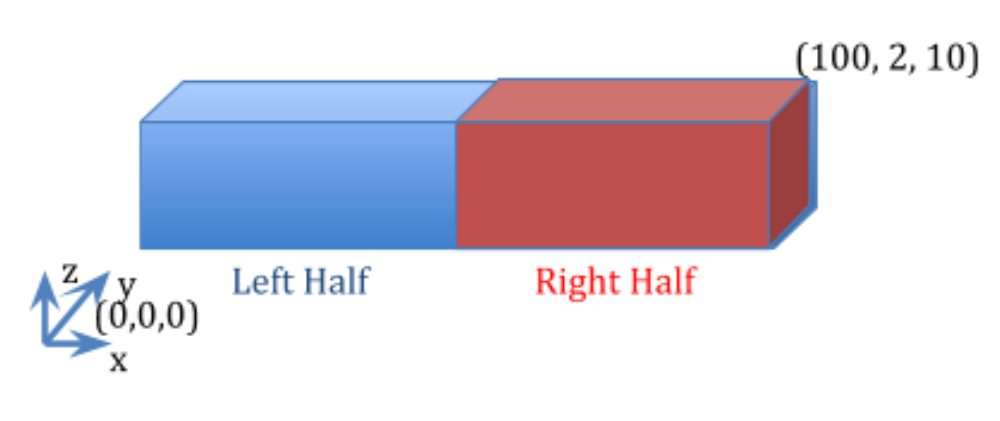

Steady-State One-Dimensional Flow: Materials in Serial
======================================================

Capabilities Tested
------------------
This one-dimensional, steady-state test shows Amanzi's capability to
simulate flow through a saturated porous medium with constant properties.  
Capabilities tested include,

  * one-dimensional representation
  * steady-state
  * saturated flow
  * heterogeneous porous medium

For details on this test, see :ref:`about_linear_materials_serial_1d`.

Background
----------
For one-dimensional, steady-state, flow through a saturated porous medium with constant properties, 
the general governing differential equation expressing mass conservation and Darcy's law becomes simply

	.. math:: \frac{d^2h}{dx^2} = 0
		:label: ode_materials_serial

where the total head (:math:`h`, [L]) is the sum of pressure head (:math:`P/\rho g`, [L]) 
and elevation (:math:`z`, [L])

	.. math:: h = \frac{P}{\rho g}+z

:math:`\rho` = density [M/L\ :sup:`3`\ ], :math:`g` = gravitational acceleration [L/T\ :sup:`2`\ ], 
and :math:`x` = horizontal distance [L]. The ordinary differential equation :eq:`ode_materials_serial` is easily solved by 
direct integration as

	.. math:: h = C_1 x + C_2
		:label: generalSoln_materials_serial

where the integration constants :math:`C_1` and :math:`C_2` depend on the boundary conditions.

For a simple heterogeneous porous medium composed of two constant-property materials in series, 
Equation :eq:`generalSoln_materials_serial` can be applied to each subregion separately
with the interface conditions treated as boundary conditions for the two subregions. To analyze this 
special case, let the subscripts *1* and *2* denote the subregions adjoining the :math:`x = 0` and :math:`x = L` 
boundaries respectively, and the subscript *i* denote the interface.

Model
-----
The analytic solution for prescribed inlet and outlet pressures is presented below.

When hydraulic head is prescribed at both boundaries as

	.. math:: 
		h(0) &= h_0\\
		h(L) &= h_L
		:label: bc_materials_serial

the analytic solutions :eq:`generalSoln_materials_serial` for hydraulic head in each subregion become

	.. math:: 
		h_1 &= (h_i - h_0) \frac{x}{L_i} + h_0\\
		h_2 &= (h_L - h_i) \frac{x-L_i}{L-L_i} + h_i
		:label: specificSolns_materials_serial

where :math:`L` = domain length [L], :math:`L_i` = position of interface [L], and :math:`h_i` 
is yet to be defined. 
The volumetric flowrate per unit area through a porous medium, or Darcy velocity (:math:`U`, [L/T]), 
is defined by Darcy's law as

	.. math:: U = -\frac{k}{\mu\rho g}\frac{dh}{dx} = -K\frac{dh}{dx}
		:label: DarcyVel_materials_serial

where :math:`k` = intrinsic permeability [L\ :sup:`2`\ ],
:math:`\mu` = viscosity [M/LT], and 
:math:`K` = hydraulic conductivity [L/T]. 
Applying Equation :eq:`DarcyVel_materials_serial` to each subregion using Equations :eq:`specificSolns_materials_serial` yields

	.. math:: 
		U_1 &= K_1\frac{h_0 - h_i}{L_i}\\
		U_2 &= K_2\frac{h_i - h_L}{L-L_i}\\
		:label: specificDarcyVels_materials_serial

Mass conservation at the interface implies :math:`U_1 = U_2`, which after some algebra leads to
an expression for hydraulic head at the interface:

	.. math:: h_i = \frac{K_1(L-L_i)h_0+K_2L_ih_L}{K_1(L-L_i)+K_2L_i}
		:label: interfaceHead_materials_serial

Equations :eq:`specificSolns_materials_serial` and :eq:`interfaceHead_materials_serial` collectively define hydraulic head across the domain, and Equation :eq:`specificDarcyVels_materials_serial` or :eq:`interfaceHead_materials_serial` the Darcy velocity. One can also
show that

	.. math:: 
		U = K_h\frac{h_0 - h_L}{L}
		:label: domainDarcyVel_materials_serial

where :math:`K_h` is the harmonic mean

	.. math:: 
		K_h = \frac{K_1K_2L}{K_1(L-L_i) + K_2L_i}
		:label: harmonicMean_materials_serial

Problem Specification
---------------------
The analytic solutions for hydraulic head and Darcy velocity can be used to test Amanzi
implementation of prescribed hydraulic head boundary conditions, Darcy's law, and mass conservation
on an elementary problem with discrete heterogeneity.

Schematic
~~~~~~~~~
The domain is shown in the following schematic.

    **One-dimensional, steady-state flow through a saturated porous medium with constant properties.**

Mesh
~~~~
A steady-flow mesh is applied.

Variables
~~~~~~~~~
To generate numerical results the following specifications are considered:

* Domain

	* :math:`x_{min} = y_{min} = z_{min} = 0`
	* :math:`x_{max} = 100 m, y_{max} = 2 m, z_{max} = 10 m`

* Horizontal flow in the x-coordinate direction

	* no-flow prescribed at the :math:`y_{min}, y_{max}, z_{min}, z_{max}` boundaries
	* prescribed hydraulic head at the x-coordinate boundaries: :math:`h(0) = 20m, h(L) = 19m`

* Material properties:

	* :math:`\rho = 998.2 \: kg/m^3, \mu = 1.002 \times 10^{-3} \: Pa\cdot s, g = 9.807 \: m/s^2` 
	* :math:`L_i = x_{max}/2`
	* :math:`K_1 = 1.0 m/d` :math:`(k = 1.1847 \times 10^{-12} \: m^2)`
	* :math:`K_2 = 10 m/d` :math:`(k = 1.1847 \times 10^{-11} \: m^2)`

* Model discretization

	* :math:`\Delta x = 5 m, \Delta y = 2 m, \Delta z = 10 m`

For these input specifications, Amanzi simulation output is expected to closely match

	.. math:: h_i = 19.090909m
		:label: expectedH_i_materials_serial

and exhibit a linear head profile within each subregion following Equations :eq:`specificSolns_materials_serial`.
The harmonic mean is :math:`1.818181818	m/d` from Equation :eq:`harmonicMean_materials_serial` and thus the 
expected Darcy velocity is 

	.. math:: U = 0.0181818 m/d 
		:label: expectedU_materials_serial

from Equation :eq:`domainDarcyVel_materials_serial`.

Results and Comparison
----------------------
The discretization is exact for linear solutions, and it is clear in the figure that
Amanzi has reproduced the exact solution.

.. plot:: amanzi_linear_materials_serial_1d.py

This is also shown in the table below.

.. include:: table_values.txt

References
----------

.. _about_linear_materials_serial_1d:

About
-----

* Directory: testing/verification/flow/saturated/steady-state/linear_materials_serial_1d

* Authors:  Greg Flach

* Maintainer(s): David Moulton, moulton@lanl.gov

* Input Files:

  * amanzi_linear_materials_serial_1d-s.xlm

    * Spec Version 2.3.0, structured mesh framework
    * mesh: steady-flow_mesh.h5
    * runs

  * amanzi_linear_materials_serial_1d-u.xml

    * Spec Version 2.3.0, unstructured mesh framework
    * runs

* Mesh Files:

  * steady-flow_mesh.h5

* Analytic solution computed with golden output

  * Subdirectory: golden_output

  * Input Files:
  
    * steady-flow_data.h5

Status
~~~~~~
.. todo:: 

  * Documentation:
    * keb: List what is expected out of Amanzi simulation output.
    * keb: Put the x's in order in the table.
