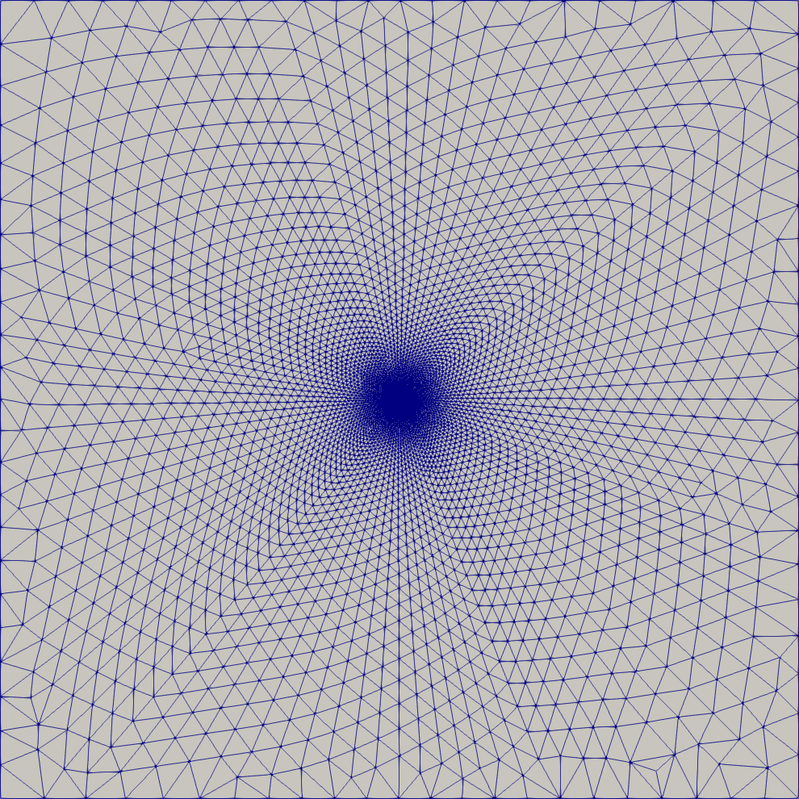

Transient Flow to a Pumping Well in an Anisotropic Aquifer (Hantush)
====================================================================

Capabilities Tested
-------------------

This transient two-dimensional flow problem in a non-leaky aquifer with constant pumping tests the Amanzi saturated flow process kernel in anistropic media.
Capabilities tested include:

  * single-phase, two-dimensional flow
  * transient flow
  * saturated flow
  * constant-rate pumping well
  * constant-head (Dirichlet) boundary conditions
  * specified volumetric flux (Neumann) boundary conditions
  * homogeneous porous medium 
  * anisotropic porous medium
  * non-uniform mesh (statically refined) 

For details on this test, see :ref:`about_hantush_anisotropic`.

Background
----------

An aquifer is homogeneous and anisotropic when the hydraulic conductivity is a function of
direction only. Because of this, the transmissivity of such an aquifer varies with direction.
The transmissivity in the major direction of anisotropy may be 2 - 10 times greater than 
in the minor direction of anisotripy. Estimates of groundwater flow may be in significant error
if the effect of such anisotropy is not accounted for. The in-place determination of the
hydraulic properties of anisotropic aquifers, then, is of great practical importance. 

Hantush and Thomas :cite:`han-Hantush_1966_method` developed an analytical solution for measuring
drawdown during constant discharge for a completely penetrating well in a
homogenous anisotropic, nonleaky confined aquifer of infinite extent. Their work follows 
Hantush's previously published work :cite:`han-Hantush_1966_wells`, extending it by describing
a method for obtaining the transmissivity in any direction and storativity of a homogeneous
anisotropic non-leaky aquifer by delineating the expected elliptical shape of an equal residual
drawdown curve. 

Model
-----

The soil permeabilty varies in the *x* and *y* directions; thus, anisotropic
condictions exist. Hantush and Thomas simplifies to the Theis solution :cite:`han-Theis1935relation`, which
assumes isotropic soil profile, when the permeabilty is equal in all
directions for all times. This solution will yield contour lines of
equal draw down by an elliptical shape.     

.. math::
    \frac{\partial }{\partial x} (T_x \frac{\partial h}{\partial x})+\frac{\partial }{\partial y} (T_y \frac{\partial h}{\partial y})
    = S \frac{\partial h}{\partial t} + Q \delta(x) \delta(y)

The initial conditions is

.. math::  h(x,y,0)=h_0

Due to the varying hydraulic conductivities two transmissivities are
defined as 

.. math:: T_x = K_xb \; \; and \;\; T_y=K_yb

Hantush and Thomas found the solution to the governing equation as

.. math:: s=h_0-h(r,t)=\frac{Q}{4 \pi \sqrt{T_x T_y}} \int_\phi^\infty
	  \frac{exp[-\tau]}{\tau} d\tau = \frac{Q}{4 \pi \sqrt{T_x T_y}} \; W(\phi)

where

.. math:: \phi = \frac{(x^2T_t + y^2T_x)\;S}{4T_xT_yt}

Notice when :math:`T_x=T_y`, :math:`\phi` is now equal to *u* and the
problem simplifies to the Theis solution :cite:`han-Theis1935relation`.  The variables in
the equations above are defined in :ref:`Variables` with subtle
differences.  We have now defined transmissivity in two directions and
redefined the well function, *W*, to apply to :math:`\phi` instead of
*u*.  The integral is still solved as a negative exponential integral.  

Problem Specification
---------------------

Schematic
~~~~~~~~~

.. figure:: schematic/ellipse.png
    :figclass: align-center
    :width: 600 px

    **Schematic of an equal drawdown curve around a well in an anisotropic aquifer.**

Mesh
~~~~

The mesh consists of 12,208 cells. There is a single cell in the z-direction, which is uniform :math:`\Delta z=5.0` m everywhere.

    **Unstructured computational mesh with 12208 cells.**

Variables
~~~~~~~~~

* Domain:
  
  * :math:`x_{min} = y_{min} = -1200`, :math:`z_{min} = 0 \text{ [m]}`
  * :math:`x_{max} = y_{max} =1200`, :math:`z_{max} = 5 \text{ [m]}`
  * aquifer thickness:    :math:`b=z_{max}-z_{min}=5 \text{ [m]}` 
  * pumping well location:    :math:`(x,y) = (0,0) \text{ [m]}`, spanning entire aquifer thickness
  * observation well locations:   

    * :math:`(x_{obs1},y_{obs1},z_{obs1}) = (55.0, 0.0, 2.0) \text{ [m]}`
    * :math:`(x_{obs2},y_{obs2},z_{obs2}) = (0.0, 55.0, 2.0) \text{ [m]}`
    * :math:`(x_{obs3},y_{obs3},z_{obs3}) = (55.0, 55.0, 2.0) \text{ [m]}`

* Boundary and initial conditions:

  * initial hydraulic head:   :math:`h(x,y,0)=h_0 \: \text{[m]}`, where :math:`h_0` is hydrostatic (i.e. drawdown :math:`s=0 \text{ [m]}`)
  * constant-head (Dirichlet) lateral boundary conditions:   :math:`h(x_{min,max},y_{min,max},t)=h_0 \: \text{[m]}`
  * no-flow (Neumann) upper and lower boundary conditions
  * well-head pumping rate:   :math:`Q=2.0 \: \text{[m}^3\text{/s]}`

    * duration of pumping:    :math:`t_{max}=86400\: \text{[s]} = 1 \text{ [day]}`

* Material properties:

  * storativity:    :math:`S=3.75 \times 10^{-4} \: \text{[-]}`

    * derived from:    :math:`S=S_s b`, where :math:`S_s=7.5 \times 10^{-5} \: \text{[m}^{-1} \text{]}` and :math:`b=5 \: \text{[m]}`
  * porosity:    :math:`\phi = 0.3`
  * transmissivity:    :math:`T_x= 1.15 \times 10^{-3}, T_y= 1.15 \times 10^{-4} \: \text{[m}^2\text{/s]}`

    * derived from:    :math:`T=Kb`, where :math:`K=\frac{k \rho g}{\mu}`

      * intrinsic permeability tensor:    :math:`k_x = 2.3543 \times 10^{-11},  k_y = k_z = 2.3543 \times 10^{-12} \: \text{[m}^2\text{]}` 

  * fluid density:    :math:`\rho = 998.2 \: \text{[kg/m}^3\text{]}`
  * dynamic viscosity:    :math:`\mu = 1.002 \times 10^{-3} \: \text{[Pa} \cdot \text{s]}` 
  * gravitational acceleration:    :math:`g = 9.807 \: \text{[m/s}^2\text{]}`
  

Results and Comparison
----------------------

.. plot:: amanzi_hantush_anisotropic_2d.py
          :align: center

       
References
----------

.. bibliography:: /bib/ascem.bib
   :filter: docname in docnames
   :style:  alpha
   :keyprefix: han-

	    
.. _about_hantush_anisotropic:

About
-----

* Directory: testing/verification/flow/saturated/transient/hantush_anisotropic_2d

* Authors: Alec Thomas, Konstantin Lipnikov

* Maintainer: David Moulton (moulton@lanl.gov)

* Input Files:

  * amanzi_hantush_anisotropic_2d-u.xml

    * Spec Version 2.3, unstructured mesh framework
    * Mesh:  porflow4_6.exo

.. * Mesh Files:

  .. * porflow4_6.exo

* Analytic Solution:

  * Directory: analytic/
   
    * test_h_tr.dat

.. todo::

  * Documentation:

    * Decide whether to keep structured run
    * Include info about analytic solution calculation?
    * convert units in Variables to be same as in Model?
