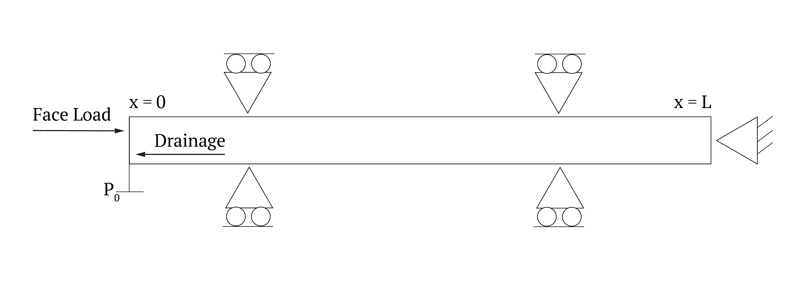

Soil Consolidation
==================

Capabilities Tested
-------------------

 * Biot poroelasticity model
 * elastic deformation
 * saturated one-dimensional flow
 * pressure and displacement boundary conditions

Background
----------

We consider a one-dimensional consolidation problem. 
A schematic of the problem is shown in figure below. 
A constant compressive load is applied on the left side of a porous sample while zero displacement 
is specified on the right side. 
The porous matrix is fully saturated, and drainage is only allowed across the left side where the compressive
load is applied. Fluid pressure on the drainage boundary is fixed at the initial pressure. The variables
of interest here are the excess pore pressure and vertical strain as a function of time.

Model
-----

Initial condition.
Pressure is constant, :math:`p(0)=p_0 = 10` MPa. 
The displacement is zero.

Boundary conditions. 
The pressure at x=0m, the left end in the domain below, is zero.
The traction is 10 MPa at the end. The displacement is zero at the right end.
The boundary  conditions on the other sides are natural conditions.

The absolute permeability tensor is isotropic, :math:`6\cdot 10^{-18} m^2/s` 
The exponential model for porosity is :math:`\phi(p)=\phi_0\ (1 + e^{c (p - p_0)})`,
where :math:`\phi_0=0.1` is the undeformed porosity and :math:`c=10^{-10}\ Pa^{-1}` is 
the compression coefficient.

The Young modules is :math:`3\cdot 10^{10}` Pa. The Poisson ratio is zero.
The Biot coefficient is 1.

Problem Specification
---------------------

The problem is solved in a box domain with length L=10 m and width 3 m. 

Mesh
~~~~

We consider a rectangular mesh with :math:`40 \times 6` cells.

Results and Comparison
~~~~~~~~~~~~~~~~~~~~~~

The solution at 10 hours is shown below.
it matches well the analytic solution which is given by the infinite series:

.. math::
  p(x,t) = \frac{4}{\pi} P_0 
  \sum_{N = 0}^{N = \infty} \frac{1}{2N + 1}\sin\left [ \frac{(2 N + 1)\pi x}{2L} \right] e^{- (2N + 1)^2 \pi^2 C_v t/4L^2}.

.. plot:: verification/mechanics/consolidation_1d/amanzi_consolidation_1d.py
   :align: center

References
----------

.. bibliography:: /bib/ascem.bib
   :filter: docname in docnames
   :style:  alpha
   :keyprefix: scinfil-

.. _about_consolidation:

About
-----

* Directory:  testing/verification/mechanics/consolidation_1d

* Maintainer:  Konstantin Lipnikov (lipnikov@lanl.gov)

* Input Files:

  * amanzi_consolidation_1d.xml

    * Spec 1.5, unstructured mesh framework
    * mesh is generated internally 

