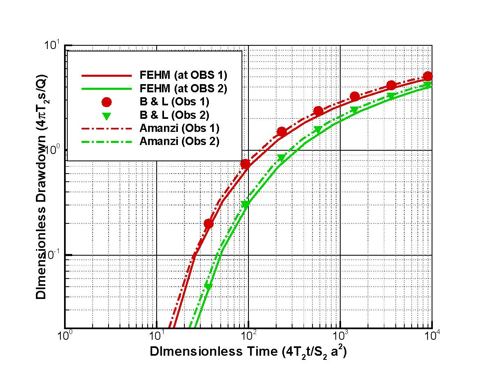

Transient 2D Heterogeneous POD  Confined Flow to a Pumping Well
===============================================================

Introduction
----------

Butler and Liu (1993) developed 
a semi-analytical solution for calculating drawdown in an aquifer system, in which a disc of one material is embedded in a matrix of differeing hydraulic properties. The problem of interest is the drawdown as a function of location and time due to pumping from a fully pentrating well located either in disc or the matrix. The differences on hydraulic properties between the disc and the matrix can be of any magnitude.
The problem is solved analytically in the Laplace space and the drawdown is solved numerically by inversion from the Laplace space to the real space.

Problem Specification
---------------------

Flow within the circular disc (:math:`i =1`) and surrounding matrix (:math:`i =2`)  can be described mathematically by the polar-coordinate form of aquifer flow equations: 

.. math:: \frac{\partial ^2 s_i}{\partial r^2} 
   + \frac{1}{r} \frac{\partial s_i}{\partial r} 
   + \frac{1}{r^2} \frac{\partial^2 s_i}{\partial \theta^2} 
   = \frac{S_i}{T_i} \frac{\partial s_i}{\partial t}
where 
:math:`s_i` is the drawdown in material :math:`i`,
:math:`t` is the time,
:math:`T_i` is the transmissivity of material :math:`i`, and
:math:`S_i` is the storage coefficient of material :math:`i`.

The initial conditions are the same for the disc and the matrix:

.. math:: s_i(r, \theta,0) =0.,  0 \le r < \infty

The boundary condition at infinite is:

.. math::    s_2(-\infty, \theta, t) =  0\\

A pumping well discharging at a constant rate :math:`Q` is assumed at location (:math:`(r_{pw}, \theta_{pw}`)
.. math:: \lim{R \rightarrow 0} 2 \pi R T_2 \frac{\partial s_2(R,t)}{\partial R} = -Q,\;\; t>0
where :math:`R` is the distance between the pumping and observation wells. To ensure the flow continuity, the auxillary conditions at the matrix-disc interfaces (:math:`r = a`) must be met:

.. math::      s_1(a,\theta,t) = s_2(a,\theta,t)\\
.. math::      T_1\frac{\partial s_1(a,\theta,t)}{\partial r} = T_2\frac{\partial s_2(a,\theta,t)}{\partial r}\\

Schematic
~~~~~~~~~

.. figure:: schematic/butler_pod_schematic.jpg
    :figclass: align-center
    :width: 600 px

    ** Schematic of the Butler and Liu pod verification problem **

Results and Comparison
----------------------

We compared the results from Amanzi against those from Butler's analytical solution for a case will the foloowing parameters:

	Transmissivity: :math:`\;\; T_1 = 0.0011574 \; m2/s`; :math:`T_2 = 0.011574 \;m2/s` 

	Storativity: :math:`\;\; S_1 = S_2 = 2\times 10^{-4}`

	Pumping rate: :math:`\;\; Q = 1000 \;m3/day (= 0.011574 \;m3/s)`

	Radius of the disc: :math:`\;\; d = 18 \;m`

	Pumping well location :math:`\;\; (600 \;m, 0^o)` in the polar coordinate with its origin at the center of the disc

	Observation well locations :math:`\;\; (40\; m, 60^o)` and :math:`(360 \; m, 120^o)`.

    ** Comparison of results from Amanzi against Butler and Liu's analytical soluation and FEHM **

References
----------

Butler, J. J., and W. Liu, 1993. Pumping tests in nonuniform aquifers: the radially asymmetric case, Water Resources Research, 29 (2), 259-269. 

About
-----

* Directory: testing/verification/flow/transient/butler_pod_2d

* Authors:  Dylan Harp, Zhiming Lu

* Maintainer(s): 

* Input Files: 

Status
~~~~~~

Add notes here about the status of the test.  

.. todo:: 

  * Documentation:
