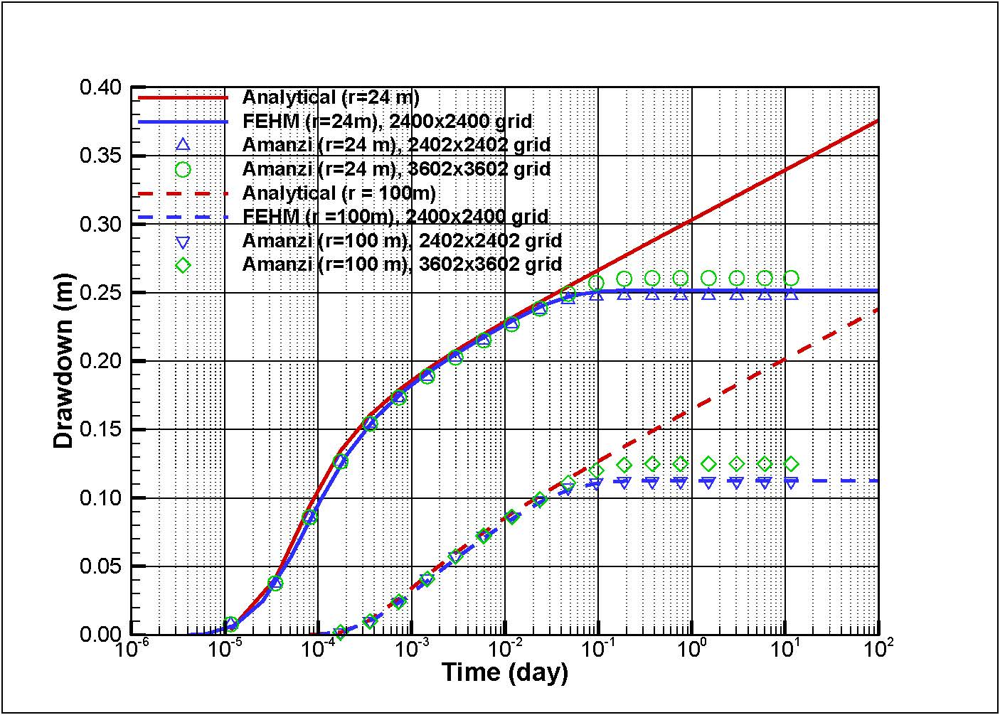

Transient 2D Heterogeneous Strip Confined Flow to a Pumping Well
================================================================

Introduction
----------

Butler and Liu (1991) developed a semi-analytical solution for calculating drawdown in an aquifer system, in which an infinite linear strip of one material is embedded in a matrix of differeing hydraulic properties. The problem of interest is the drawdown as a function of location and time due to pumping from a fully pentrating well located in any of three zones. The problem is solved analytically in the Fourier-Laplace space and the drawdown is solved numerically by inversion from the Fourier-Laplace space to the real space.

Problem Specification
---------------------

Flow within zones that do not contain the pumping well can be described mathematially as

.. math:: \frac{\partial ^2 s_i}{\partial x^2} 
   + \frac{\partial ^2 s_i}{\partial y^2} 
   = \frac{S_i}{T_i} \frac{\partial s_i}{\partial t}
where 
:math:`s_i` is the drawdown in material :math:`i`,
:math:`t` is the time,
:math:`T_i` is the transmissivity of material :math:`i`, and
:math:`S_i` is the storage coefficient of material :math:`i`.

Flow within zones that contain the pumping well can be represented as

.. math:: \frac{\partial ^2 s_i}{\partial x^2} 
   + \frac{\partial ^2 s_i}{\partial y^2} 
   + \frac{Q}{T_i} \delta(x-a)\delta(x-b)
   = \frac{S_i}{T_i} \frac{\partial s_i}{\partial t}
where
:math:`Q` is the pumpage from well located at :math:`(a,b)`
:math:`\delta(x)` is the Direc delta function, being :math:`1` for :math:`x = 0` and :math:`0` otherwise.

The initial conditions are the same for all three zones:

.. math:: s_i(x,y,0) =0.

The boundary conditions are:

.. math:: 
.. math::    s_1(-\infty, y, t) =  0\\
.. math::      s_i(x,\pm\infty, t) =  0 \\
.. math::     s_3(\infty, y, t) =  0\\
.. math::     s_1(-d, y, t) =  s_2(-d, y, t)\\
.. math::     s_2(0, y, t) =  s_3(0, y, t)\\
.. math::      T_1\frac{\partial s_1(-d,y,t)}{\partial x} = T_2\frac{\partial s_2(-d,y,t)}{\partial x}\\
.. math::      T_2\frac{\partial s_2(0,y,t)}{\partial x} = T_3\frac{\partial s_3(0,y,t)}{\partial x}

Schematic
~~~~~~~~~

.. figure:: schematic/butler_strip_schematic.png
    :figclass: align-center
    :width: 600 px

    ** Schematic of the Butler and Liu Linear Strip verification problem **

Results and Comparison
----------------------

We compared the results from Amanzi against those from Butler's analytical solution for a case will the foloowing parameters:

	Transmissivity: :math:`\;\; T_1 = 0.11574 \; m2/s`; :math:`T2 = 0.011574 \;m2/s` :math:`T3 = 0.0011574 \;m2/s`

	Storativity: :math:`\;\; S_1 = 5\times 10^{-4}`; :math:`S_2 = 2\times 10^{-4}`; :math:`S_3 = 2\times 10^{-5}`;

	Pumping rate: :math:`\;\; Q = 1000 \;m3/day (= 0.011574 \;m3/s)`

	Width of the strip: :math:`\;\; d = 18 \;m`

	Pumping well location :math:`\;\; (9 m, 0 m)`

	Observation well locations :math:`\;\; (15 m, 0 m)` and :math:`(91 m, 0 m)`, which gives the distance between the pumping well and observation well :math:`r = 24\;m` and :math:`r = 100 \;m`, respectively.

    ** Comparison of results from Amanzi against Butler and Liu's analytical soluation and FEHM **

References
----------

Butler, J. J., and W. Liu, 1991. Pumping tests in non-uniform aquifers the linear strip case, Journal of Hydrology, 128, 69-99.

About
-----

* Directory: testing/verification/flow/transient/butler_strip_2d

* Authors:  Dylan Harp, Zhiming Lu

* Maintainer(s): 

* Input Files: now.dat

Status
~~~~~~

Add notes here about the status of the test.  

.. todo:: 

  * Documentation:
